# OpenAgentd

<p align="center">
  
</p>

[](https://github.com/lthoangg/openagentd/blob/main/LICENSE)
[](https://www.python.org/)
[](https://fastapi.tiangolo.com/)
[](https://react.dev/)

**The desktop cockpit for local AI agents.** A double-click app that runs a team of AI agents on your machine, with a real UI to watch every step. Multiple windows, coding workspaces, git worktrees, scheduled tasks, local telemetry, and your own keys. Open source.

[Features](https://github.com/lthoangg/openagentd/blob/main/documents/docs/features.md) · [Issues / roadmap](https://github.com/lthoangg/OpenAgentd/issues) · [Documentation](https://github.com/lthoangg/openagentd/blob/main/documents/docs/index.md) · [Migration](https://github.com/lthoangg/openagentd/blob/main/MIGRATION.md)


---

## Screenshots

| Home | Split team cockpit |
|---|---|
| 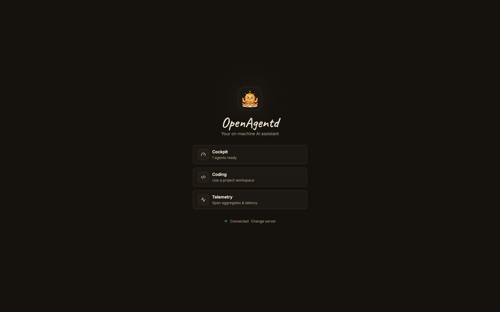 |  |

| Coding workspace | Diff inspector |
|---|---|
| 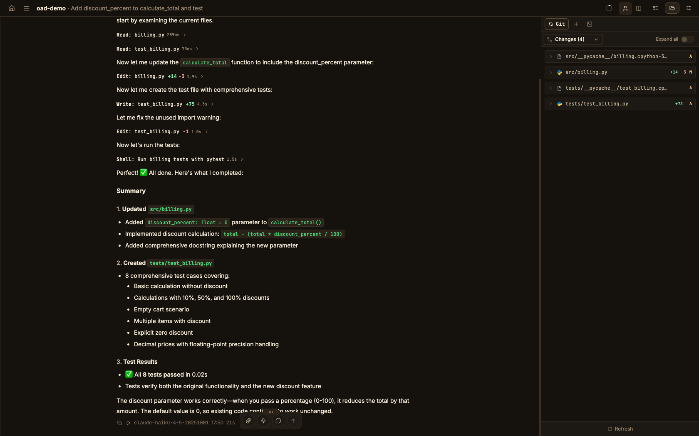 |  |

| Providers settings | Sandbox settings |
|---|---|
| 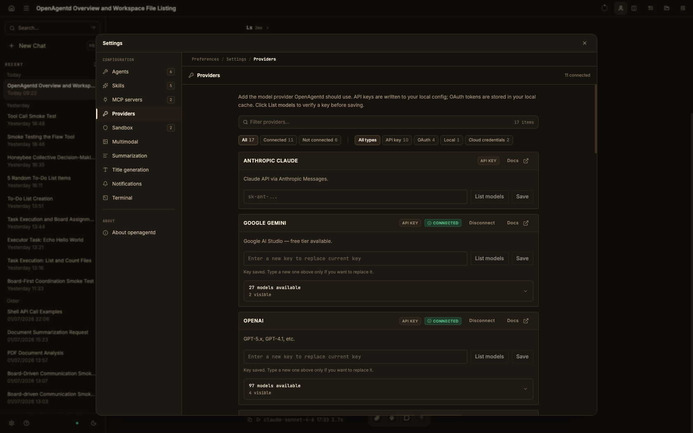 | 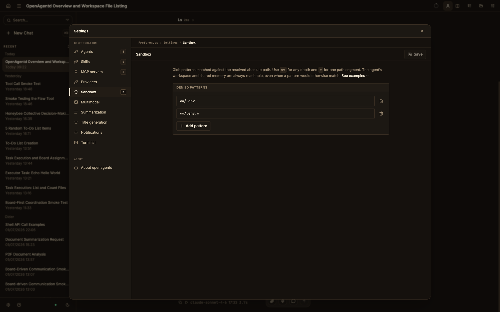 |

| Scheduler | Telemetry dashboard |
|---|---|
| 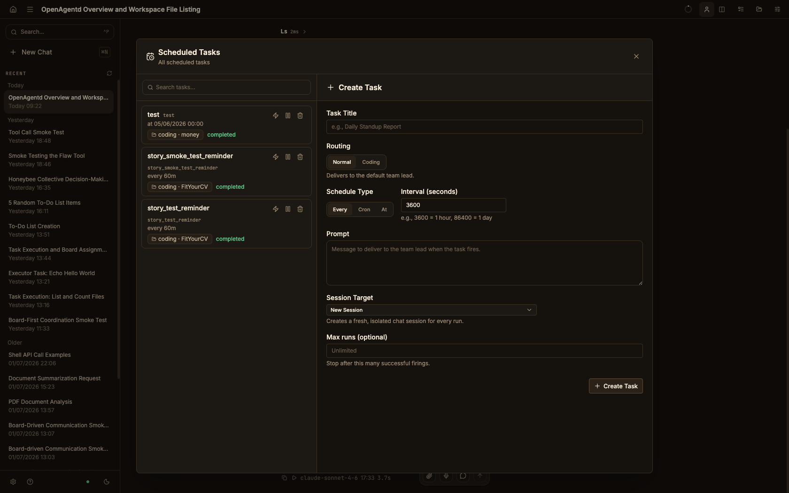 |  |

| Command palette | Shell mode |
|---|---|
| 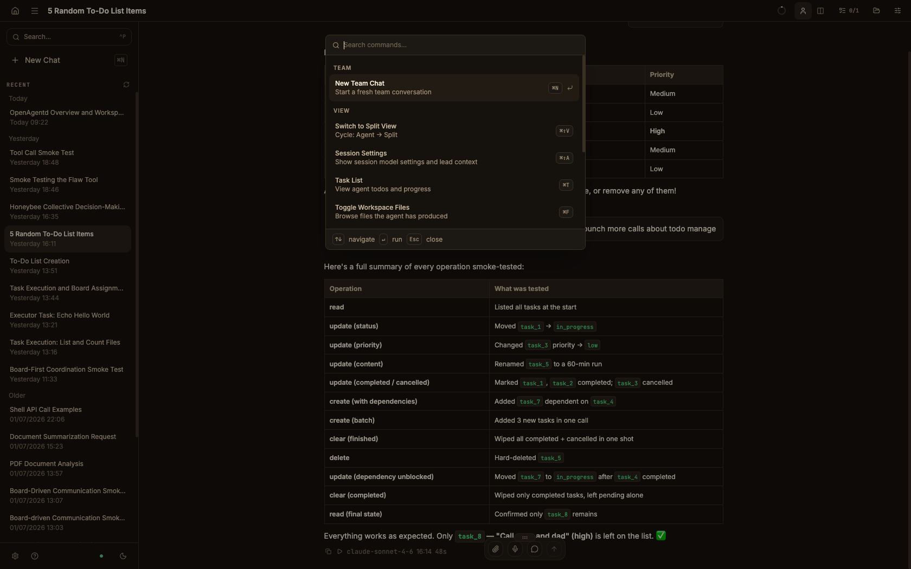 | 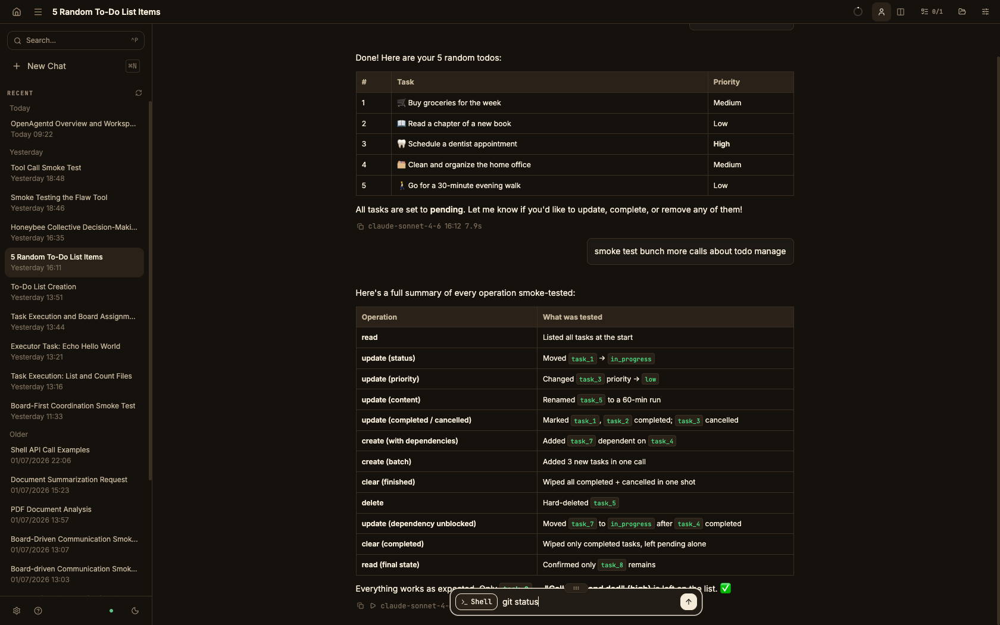 |

| Git commit tree | Terminal tab |
|---|---|
| 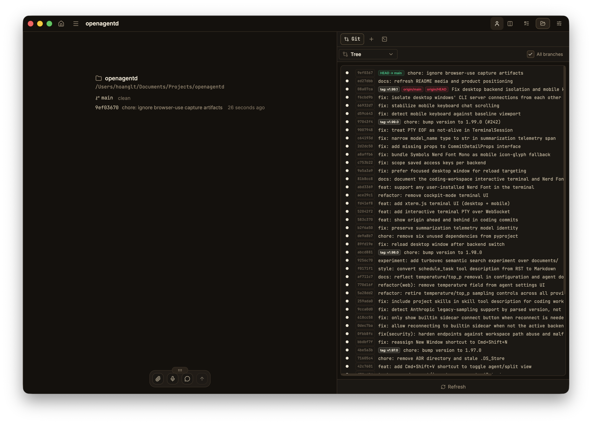 | 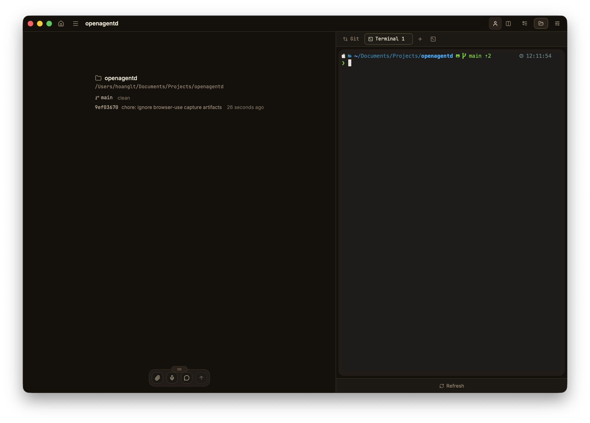 |

| Session settings | Image lightbox |
|---|---|
| 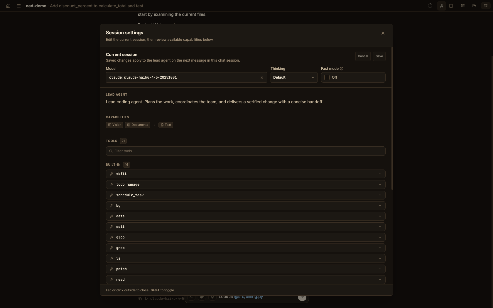 | 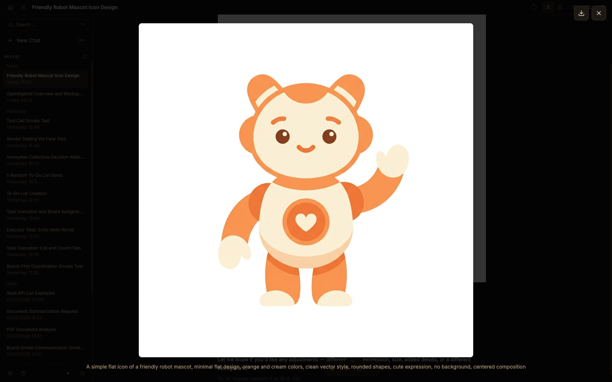 |

| Todos board | MCP settings |
|---|---|
| 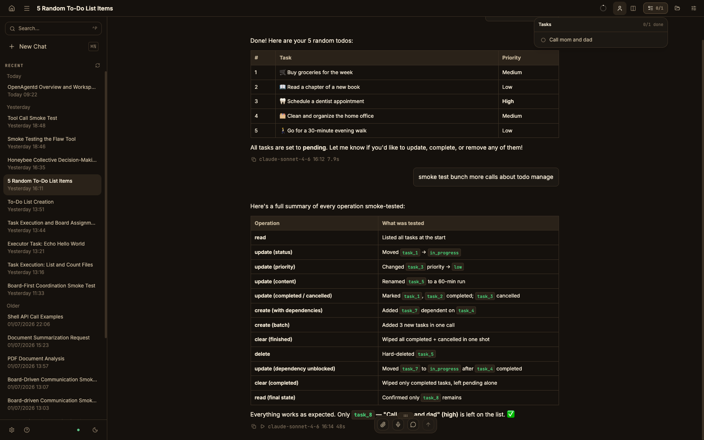 | 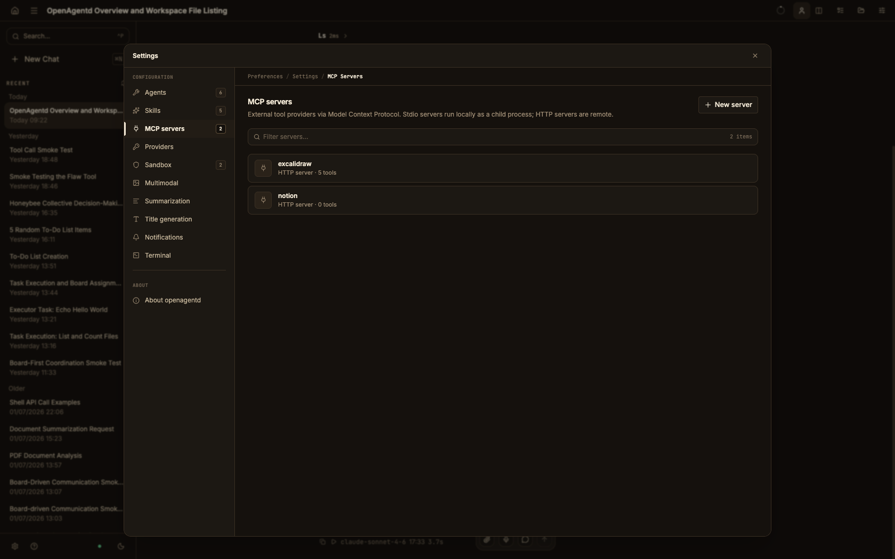 |

| Mobile backend settings | Mobile coding view |
|---|---|
| 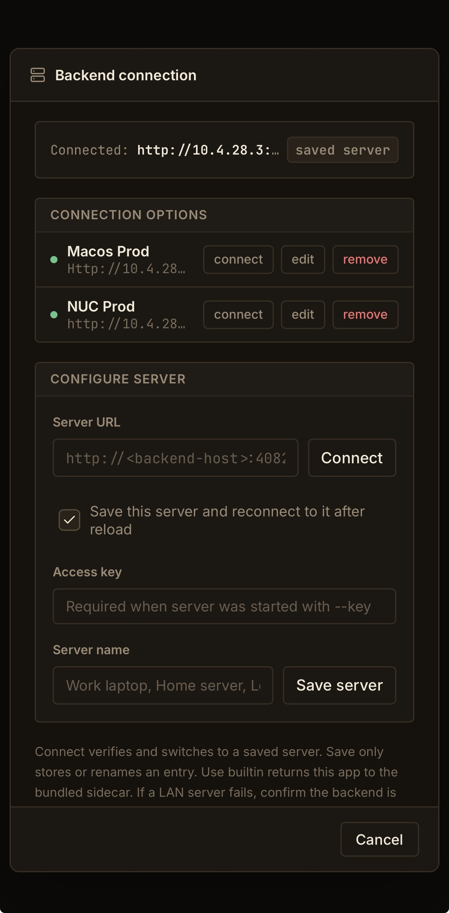 | 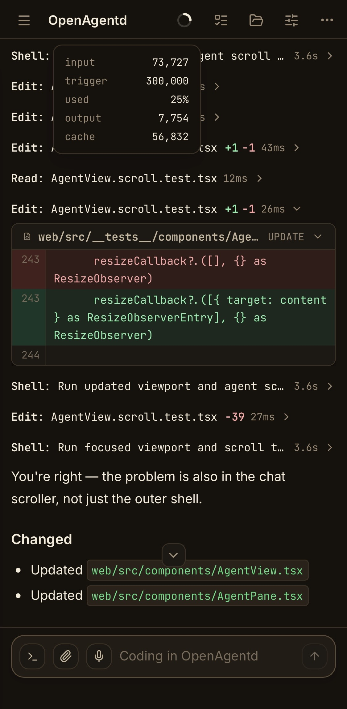 |


---

## What you get

A short list of the most important shipped capabilities. The canonical, version-cited catalogue is [`documents/docs/features.md`](https://github.com/lthoangg/openagentd/blob/main/documents/docs/features.md); other feature requests and future work live in [GitHub issues](https://github.com/lthoangg/OpenAgentd/issues).

**A cockpit, not a chat box.** OpenAgentd gives you the missing UI around tool-using agents: command palette (⌘P/Ctrl+P), slash commands (`/init`, `/continue`, `/compact`, `/undo`, `/redo`), direct shell sends with `!command`, drag-and-drop attachments, a shared lightbox for generated and uploaded media, and a tool inspector that exposes arguments, status, timing, results, and inline Git-like diffs.

**Run a team, not just one agent.** A lead agent can spawn specialist instances on demand, coordinate them through an async mailbox, and manage what tools, skills, or MCP servers each member can use. You can watch lead and worker sessions side by side in the split cockpit, follow each agent's output live, collapse back to a unified chronological transcript, or open multiple desktop windows when one conversation is not enough.

**Use it as a coding cockpit.** Coding mode opens any local project folder with a workspace-aware team, a repo tree, live git changes, commit history/tree views, file previews, and an interactive terminal tab in one place. Create isolated git worktree sessions from the UI, inspect staged/unstaged diffs in the right-side dock, browse recent commits and branch structure, open `@file` mentions directly into the preview panel, and jump into shell mode without leaving the composer. After an agent edits code, OpenAgentd runs the project's own language servers over the change and feeds diagnostics back into the tool result so the next turn can fix them immediately. Python's pinned `ty` and `ruff` work out of the box; TypeScript support is a consented, managed backend component.

**Pick your model, no lock-in.** OpenAgentd ships with 15 first-class providers — Anthropic, Gemini, OpenAI, OpenRouter, Bedrock, Grok, DeepSeek, Ollama, and more — while keeping the config format simple: `provider:model`. Manage provider connections from Settings, choose which models stay visible in pickers, and override the lead model or thinking level per session from Session Settings. Assistant replies keep the effective model in history so overrides stay auditable.

**Desktop + mobile clients.** The main experience is the desktop cockpit on macOS, Windows, and Linux, and there is also a Tauri mobile app that connects to a remote OpenAgentd server over LAN or the internet. Mobile uses the same shared UI, adapted for touch, safe areas, backend switching, and single-pane navigation, including coding sessions on a phone-sized screen.

**Operate locally, extend when needed.** Scheduled tasks support cron, interval, and one-shot runs; todos stay on a live board; telemetry stays on your machine; MCP servers hot-reload from Settings; and sandbox rules plus permission decisions are managed without editing hidden app internals by hand.

---

## Why OpenAgentd

Coding agents (Claude Code, Codex CLI, Cursor, Windsurf, Aider, opencode) all run agents with tools now. The real difference is **the shape of the workflow they fit into** — terminal session, IDE window, or a desktop cockpit.

|                            | **openagentd**                              | **Claude Code**             | **Codex CLI**         | **Cursor / Windsurf**     |
|----------------------------|---------------------------------------------|-----------------------------|-----------------------|---------------------------|
| **Surface**                | Desktop app + mobile app + web cockpit      | Terminal (CLI)              | Terminal (CLI)        | IDE (VS Code fork)        |
| **Multi-agent**            | Lead + workers, split-pane live view        | Sub-agents (sequential)     | —                     | —                         |
| **Watch live**             | Tool inspector + diffs + per-call timing    | Terminal text               | Terminal text         | Inline in editor          |
| **Direct shell from input**| `!command` shell mode + structured history  | CLI shell escapes           | CLI shell escapes     | Terminal/editor tasks     |
| **Git worktree sessions**  | Managed worktrees as repo children in UI    | Manual git setup            | Manual git setup      | IDE/git extension flow    |
| **`/undo` across chat**    | Restores workspace files from any prior turn| —                           | —                     | Editor undo only          |
| **Providers**              | 15 — bring your own keys                    | Anthropic only              | OpenAI only           | A few, subscription       |
| **License / cost**         | Apache 2.0, your keys                       | Proprietary + sub           | Proprietary + sub     | $20/mo+ subscription      |

Full capability matrix (incl. Aider + opencode): [`documents/docs/comparison.md`](https://github.com/lthoangg/openagentd/blob/main/documents/docs/comparison.md). Canonical feature catalogue with version-cited ship dates: [`documents/docs/features.md`](https://github.com/lthoangg/openagentd/blob/main/documents/docs/features.md).

---

## Quick start

**Desktop app** — install the latest release with one command, or download it from the [latest release](https://github.com/lthoangg/openagentd/releases/latest). OpenAgentd is the primary desktop cockpit on macOS, Windows, and Linux, with support for multiple app windows and coding worktree sessions:

```bash
curl -fsSL https://raw.githubusercontent.com/lthoangg/openagentd/main/install.sh | sh
```

| Platform | Artefact | First-launch note |
|---|---|---|
| macOS (Apple Silicon) | `brew install --cask lthoangg/tap/openagentd` *or* `OpenAgentd_*_aarch64.dmg` | The cask ad-hoc signs and installs automatically. With the `.dmg`, run the bundled `install.sh` then right-click → **Open**. The app is unsigned — [why](https://github.com/lthoangg/openagentd/blob/main/documents/docs/install.md#desktop-unsigned). |
| Windows (x64) | `OpenAgentd_*_x64_en-US.msi` | Open the MSI. Unsigned builds may trigger SmartScreen; verify the GitHub release source before choosing **More info → Run anyway**. |
| Linux | `OpenAgentd_*_amd64.AppImage` *or* `OpenAgentd_*_amd64.deb` | Run the AppImage directly (`chmod +x`, then execute it) or install the `.deb` with your package manager, e.g. `sudo apt install ./OpenAgentd_*_amd64.deb`. |

macOS — after mounting the `.dmg`:

```bash
cd /Volumes/OpenAgentd*
./install.sh --install            # ad-hoc signs + copies to /Applications
```

Then right-click **OpenAgentd.app → Open** the first time (single-click won't work).

**CLI / API server** (terminal install — backend only; connect from the desktop app via **Server connection**):

```bash
# macOS / Linux
uv tool install openagentd        # recommended
brew install lthoangg/tap/openagentd
```

```bash
openagentd init   # pick provider + API key, install default agents
openagentd        # API server on http://localhost:4082
```

For phones or another desktop on the same network:

```bash
openagentd start --lan --key   # bind 0.0.0.0, save an access key, and print the LAN/mobile URL
openagentd address       # show local + LAN URLs again later
openagentd health        # verify the backend is reachable and ready
```

**Mobile app** — OpenAgentd also ships a Tauri mobile client for connecting to a remote OpenAgentd server. Use `openagentd start --lan --key` on your host machine, then connect from the phone with the same backend-connection flow. See [`documents/docs/mobile.md`](https://github.com/lthoangg/openagentd/blob/main/documents/docs/mobile.md).

Other install options (pip, pipx, from source) — see [`documents/docs/install.md`](https://github.com/lthoangg/openagentd/blob/main/documents/docs/install.md).

Useful maintenance commands:

```bash
openagentd start --lan --key    # expose backend to desktop/mobile on your LAN with access-key auth
openagentd restart              # restart the background server
openagentd address              # show local and LAN server URLs
openagentd health               # run server/mobile diagnostics
openagentd status               # show PID, URLs, and log path
openagentd logs                 # tail the local server log
openagentd doctor               # check install health
openagentd cleanup              # dry-run cleanup for generated artifacts older than 14 days
openagentd cleanup --apply      # delete the listed generated artifacts
openagentd upgrade              # stop, upgrade, and restart if running
```

Generated artifacts are session-scoped under `{OPENAGENTD_DATA_DIR}/sessions/{session_id}/`, not inside the active workspace or coding repo. Todos live at `.todos.json` inside that session artifact directory; bulky tool output lives under `.tool_results/`, including shell spills at `.tool_results/shell/`. Deleting a normal session removes its workspace and session artifact directory. Deleting a coding session keeps the project directory and removes only that session's app-managed artifacts.

---

## Migrate from OpenClaw or Hermes Agent

Import existing identity and context Markdown files into one OpenAgentd lead agent:

```bash
openagentd migrate openclaw --from ~/.openclaw/workspace --model openai:gpt-5.5
openagentd migrate hermes --from ~/.hermes --model openai:gpt-5.5
```

Existing agent files are not overwritten unless `--force` is passed. See [`MIGRATION.md`](https://github.com/lthoangg/openagentd/blob/main/MIGRATION.md) for setup migration from OpenClaw, Hermes, Claude Code, and Codex CLI.

---

## Providers

Switch models with a single line in your agent's `.md` config file. Every provider uses the `provider:model` format, and Settings → Providers can manage OAuth connections, API-key-backed providers, visible-model filters, and per-provider status from the UI.

| Provider | Format | Auth |
|---|---|---|
| Anthropic Claude | `anthropic:claude-sonnet-4-6` | `ANTHROPIC_API_KEY` |
| Google Gemini | `googlegenai:gemini-3.1-flash` | `GOOGLE_API_KEY` |
| Google Vertex AI | `vertexai:gemini-3-flash-preview` | `VERTEXAI_API_KEY` or GCP creds |
| OpenAI | `openai:gpt-5.5` | `OPENAI_API_KEY` |
| OpenRouter | `openrouter:qwen/qwen3.6-plus:free` | `OPENROUTER_API_KEY` |
| ZAI / GLM | `zai:glm-5-turbo` | `ZAI_API_KEY` |
| xAI Grok | `xai:grok-4.20` | `XAI_API_KEY` |
| DeepSeek | `deepseek:deepseek-v4-flash` | `DEEPSEEK_API_KEY` |
| AWS Bedrock | `bedrock:anthropic.claude-sonnet-4-6` | AWS profile / default chain |
| NVIDIA NIM | `nvidia:stepfun-ai/step-3.5-flash` | `NVIDIA_API_KEY` |
| GitHub Copilot | `copilot:gpt-5.4-mini` | `openagentd auth copilot` |
| OpenAI Codex | `codex:gpt-5.5` | `openagentd auth codex` |
| Router9 (local) | `router9:cc/claude-sonnet-4-5` | `ROUTER9_API_KEY` (optional `ROUTER9_BASE_URL`) |
| CLIProxyAPI (local) | `cliproxy:gemini-2.5-pro` | `CLIPROXY_API_KEY` (optional `CLIPROXY_BASE_URL`) |
| Ollama (local + cloud) | `ollama:llama3.2` · `ollama:kimi-k2.6-cloud` | none (cloud: `ollama signin`) |

In the cockpit, Session Settings can override the lead agent's model and thinking level for the current chat; history keeps the model used for each user turn, and assistant reply footers show the effective model that produced the response.

---

## Built-in tools

OpenAgentd starts with a compact local toolbelt for files, shell, web, generation, scheduling, and team coordination:

| Category | Tools |
|---|---|
| Filesystem | `read`, `write`, `edit`, `patch`, `ls`, `glob`, `grep`, `rm` |
| Shell | `shell`, `bg` (background processes) |
| Web | `web_search`, `web_fetch` |
| Generation | `generate_image`, `generate_video` |
| Scheduling | `schedule_task` |
| Tasks | `todo_manage` |
| Team coordination | `team_message`, `team_manage` (teams only) |
| Utility | `date`, `skill` |

Add any MCP server to expose more tools without writing custom app code.

---

## Agents and teams

OpenAgentd ships with a compact cockpit team. The desktop app can open multiple windows, while coding sessions can branch into separate git worktree-backed workspaces when you need isolated changes:

| Agent | Role | Specialty |
|---|---|---|
| **openagentd** | Lead | Coordinates the team, receives user messages, spawns members, delegates |
| **executor** | Member blueprint | File creation, builds, shell commands, tangible artifacts |
| **explorer** | Member blueprint | Web research, codebase exploration, information gathering |

Configure your team by editing `.md` files in your config directory. Exactly one agent must have `role: lead`; the rest are member blueprints. The lead uses `team_manage` to spawn/dismiss live instances (`executor#1`, `explorer#1`) and `team_message` to delegate and collect results.

Fresh installs also seed a separate coding team under `agents/coding/`. Open `/coding` to select a server-local project folder and start workspace-aware sessions; Settings shows those agents as `coding/openagentd`, `coding/coder`, and `coding/explorer`.

### Agent config at a glance

```yaml
---
name: my-agent
role: member
description: Handles deep research tasks
model: googlegenai:gemini-3.1-flash
thinking_level: high
tools:
  - web_search
  - web_fetch
  - read
  - note
mcp:
  - context7
---

System prompt goes here.
```

Member instances are created lazily from `role: member` configs. Re-spawning an explicit handle restores its history for the current lead session; dismissing an instance only removes it from the live roster.

---

## Voice input

Click the mic button in the chat input to start voice input. Click again to stop. OpenAgentd uses the speech recognition built into your browser or app WebView and inserts the final transcript into the input for review — you still press Send manually.

There is no backend speech service, no `faster-whisper` dependency, and no `speech.yaml` setting. If the current browser/WebView does not expose speech recognition, the mic button is disabled with an explanatory tooltip. Platform privacy and cloud/local processing semantics are controlled by the browser or operating system speech service.

On macOS, voice input depends on the system speech service. If **Siri & Dictation** / **Dictation** is disabled in System Settings, Screen Time, or device management policy, speech recognition can fail with errors such as `Siri and Dictation are disabled` or `Microphone permission check has failed`. Enable **System Settings → Keyboard → Dictation**, then retry the mic flow.

---

## Mobile app

OpenAgentd also has a Tauri mobile app for iPhone-class devices. It connects to a remote OpenAgentd server instead of bundling the Python backend locally, making it a companion client for the machine already running `openagentd start --lan --key` or another reachable server.

Mobile uses the shared backend-connection flow, the same React UI, and touch-first adaptations such as safe-area-aware layouts, keyboard-aware composer spacing, and single-pane navigation. See [`documents/docs/mobile.md`](https://github.com/lthoangg/openagentd/blob/main/documents/docs/mobile.md).

---

## Scheduler

Create tasks that run on a schedule or fire once at a specific time:

- **Cron** — standard five-field cron expressions
- **Interval** — every N seconds, minutes, or hours
- **At** — one-shot at an exact datetime

Tasks appear in the `/scheduler` panel. Pause, resume, or trigger them manually from the UI or via the REST API.

---

## Observability

OpenAgentd exports OpenTelemetry spans to local JSONL partitions and serves a built-in dashboard at `/telemetry`:

- **Summary** — token usage, error rates, latency distribution, model breakdown
- **Trace explorer** — full span waterfall per session, filterable by date range

No external collector required. All data stays on your machine.

---

## Skills

Skills are `.md` files that inject domain-specific instructions into an agent's context on demand. They ship separately from agent configs, so one skill can be reused by any agent.

Builtin operational skills:

| Skill | Purpose |
|---|---|
| `self-healing` | Agent edits its own config (model, tools, MCP, image/video settings) |
| `mcp-installer` | Install new MCP servers from the UI or by description |
| `skill-installer` | Install new skills from a URL or from scratch |
| `plugin-installer` | Install agent plugins |

Add your own by dropping a `SKILL.md` file into `{config_dir}/skills/{name}/` or via the `/settings/skills` UI.

---

## MCP servers

OpenAgentd starts with an empty `mcp.json`. Add Context7 or any other MCP server via the `/settings/mcp` panel or by editing `mcp.json` directly. Changes are hot-reloaded without a restart.

```json
{
  "servers": {
    "my-server": {
      "command": "npx",
      "args": ["my-mcp-package"],
      "env": { "API_KEY": "${MY_API_KEY}" }
    }
  }
}
```

---

## Sandbox and permissions

**Filesystem sandbox** — A denylist blocks access to OpenAgentd's own data, state, and cache directories. Add your own glob patterns (`**/.env`, `**/secrets/**`) in `sandbox.yaml`. Changes take effect immediately, no restart needed.

**Permission system** — By default, tools auto-approve and log. Switch to interactive mode to block on sensitive operations and reply per-request with `once`, `always`, or `reject`. Permission decisions are persisted and replayed across turns.

---

## Documentation

Full documentation index: [`documents/docs/index.md`](https://github.com/lthoangg/openagentd/blob/main/documents/docs/index.md).

### Getting started

| Section | Contents |
|---------|----------|
| [**Features**](https://github.com/lthoangg/openagentd/blob/main/documents/docs/features.md) | **Canonical, version-cited catalogue of every user-visible feature.** Source of truth for slides, docs, and comparisons. |
| [Roadmap / issues](https://github.com/lthoangg/openagentd/blob/main/documents/docs/roadmap.md) | Short planning note with links to GitHub issues for feature requests, future work, and known issues. |
| [Install](https://github.com/lthoangg/openagentd/blob/main/documents/docs/install.md) | Desktop app first (macOS/Linux); CLI/uv/pipx/pip, source. |
| [Migration](https://github.com/lthoangg/openagentd/blob/main/MIGRATION.md) | Move setup from OpenClaw, Hermes, Claude Code, Codex CLI, or older OpenAgentd installs |
| [CLI reference](https://github.com/lthoangg/openagentd/blob/main/documents/docs/cli.md) | Every `openagentd` subcommand |
| [Slash commands](https://github.com/lthoangg/openagentd/blob/main/documents/docs/commands.md) | Reusable `/name` prompt templates; reuses your opencode command library |
| [Shell commands](https://github.com/lthoangg/openagentd/blob/main/documents/docs/shell-commands.md) | Opencode-style `!command` sends that run directly through the shell tool |
| [Configuration overview](https://github.com/lthoangg/openagentd/blob/main/documents/docs/configuration.md) | Hub — links into the focused subpages below |
| [Environment variables](https://github.com/lthoangg/openagentd/blob/main/documents/docs/configuration/env.md) | `Settings` fields, provider keys, optional extras |
| [Paths & XDG roots](https://github.com/lthoangg/openagentd/blob/main/documents/docs/configuration/paths.md) | DATA / CONFIG / STATE / CACHE / WORKSPACE |
| [LLM providers](https://github.com/lthoangg/openagentd/blob/main/documents/docs/configuration/providers.md) | Every registered prefix, OAuth flows, capability YAML |
| [Agent files](https://github.com/lthoangg/openagentd/blob/main/documents/docs/configuration/agents.md) | `.md` frontmatter schema, validation, editing workflow |
| [Built-in tools](https://github.com/lthoangg/openagentd/blob/main/documents/docs/configuration/tools.md) | Filesystem, shell, web, multimodal, scheduling, tasks, notes, team |
| [LSP diagnostics](https://github.com/lthoangg/openagentd/blob/main/documents/docs/configuration/lsp.md) | Coding-mode language-server feedback on edits, server selection, `lsp:` config |
| [Skills](https://github.com/lthoangg/openagentd/blob/main/documents/docs/configuration/skills.md) | `SKILL.md` format, builtin skill catalog |
| [Sandbox & permissions](https://github.com/lthoangg/openagentd/blob/main/documents/docs/configuration/sandbox.md) | Denylist paths, user `sandbox.yaml`, permission services |
| [Comparison](https://github.com/lthoangg/openagentd/blob/main/documents/docs/comparison.md) | How OpenAgentd compares to Claude Code, Codex CLI, Cursor/Windsurf, Aider, opencode |
| [Troubleshooting](https://github.com/lthoangg/openagentd/blob/main/documents/docs/troubleshooting.md) | Common desktop-app and CLI/server issues |

### Architecture & internals

| Section | Contents |
|---------|----------|
| [Architecture](https://github.com/lthoangg/openagentd/blob/main/documents/docs/architecture.md) | C4 diagrams, in-memory SSE streaming, SSE event protocol |
| [Agent engine](https://github.com/lthoangg/openagentd/tree/main/documents/docs/agent) | Loop, hooks, tools, teams, plugins, context, summarization |
| [Lazy team members](https://github.com/lthoangg/openagentd/blob/main/documents/docs/agent/team-lazy-spawn.md) | Spawn/dismiss member instances, `blueprint#N` handles, history restore |
| [API reference](https://github.com/lthoangg/openagentd/blob/main/documents/docs/api/index.md) | HTTP endpoints, SSE events, file handling |

### Operations

| Section | Contents |
|---------|----------|
| [Logging](https://github.com/lthoangg/openagentd/blob/main/documents/docs/logging.md) | App log + per-session JSONL, rotation, console format |
| [Observability](https://github.com/lthoangg/openagentd/blob/main/documents/docs/observability.md) | OTel spans, DuckDB-backed `/api/observability/*`, `/telemetry` UI |
| [Desktop distribution](https://github.com/lthoangg/openagentd/blob/main/documents/docs/desktop.md) | Tauri v2 shell, Python sidecar, token auth, release pipeline |
| [Mobile app](https://github.com/lthoangg/openagentd/blob/main/documents/docs/mobile.md) | Tauri mobile shell for remote OpenAgentd API servers, backend connection flow, and touch-first layout details |
| [Title generation](https://github.com/lthoangg/openagentd/blob/main/documents/docs/title-generation.md) | LLM-generated session titles, SSE event, config |

### Frontend (`web/`)

| Section | Contents |
|---------|----------|
| [App chrome](https://github.com/lthoangg/openagentd/blob/main/documents/docs/web/chrome.md) | Shared header, platform detection, Tauri drag, macOS overlay |
| [Coding sessions UI](https://github.com/lthoangg/openagentd/blob/main/documents/docs/web/coding-sessions.md) | Coding session restore, workspace sidebar pagination, reload/error handling |
| [Workspace Files](https://github.com/lthoangg/openagentd/blob/main/documents/docs/web/workspace-files.md) | Session files, coding Files & Diff, previews, downloads |
| [Todos popover](https://github.com/lthoangg/openagentd/blob/main/documents/docs/web/todos.md) | Task board, assignments, claims, dependencies, live updates |
| [Tool rendering](https://github.com/lthoangg/openagentd/blob/main/documents/docs/web/tool-results.md) | Tool call/result UI and custom renderers |
| [Chat input & queue](https://github.com/lthoangg/openagentd/blob/main/documents/docs/web/chat-input.md) | Consecutive message queuing, `PendingMessageQueue` |
| [Voice input](https://github.com/lthoangg/openagentd/blob/main/documents/docs/web/voice-input.md) | Client speech recognition and transcript insertion |
| [Mobile layout](https://github.com/lthoangg/openagentd/blob/main/documents/docs/web/mobile.md) | Phone-first responsive design — breakpoints, safe areas |

### Contributing

| Section | Contents |
|---------|----------|
| [Guidelines](https://github.com/lthoangg/openagentd/blob/main/documents/docs/guidelines.md) | Dev commands, code style, testing patterns, GitHub conventions |
| [Team testing](https://github.com/lthoangg/openagentd/blob/main/documents/docs/testing/team.md) | Manual smoke-test recipes for the multi-agent team |

---

## Star History

<a href="https://www.star-history.com/?repos=lthoangg%2Fopenagentd&type=date&legend=top-left">
 <picture>
   <source media="(prefers-color-scheme: dark)" srcset="https://api.star-history.com/chart?repos=lthoangg/openagentd&type=date&theme=dark&legend=top-left&sealed_token=xGIb0w6wCKhl8aV6Py0yLuRKogYOZByR_k-wEVuZLgIEe3m7maPgY71pwr6LRAzJJy7sgeX1JYTfbwmvnAfefBtiiTz6qdVBujSzMmkUOMfsOpB5_Z_pZg" />
   <source media="(prefers-color-scheme: light)" srcset="https://api.star-history.com/chart?repos=lthoangg/openagentd&type=date&legend=top-left&sealed_token=xGIb0w6wCKhl8aV6Py0yLuRKogYOZByR_k-wEVuZLgIEe3m7maPgY71pwr6LRAzJJy7sgeX1JYTfbwmvnAfefBtiiTz6qdVBujSzMmkUOMfsOpB5_Z_pZg" />
   
 </picture>
</a>

---

## Contributing

See [CONTRIBUTING.md](https://github.com/lthoangg/openagentd/blob/main/CONTRIBUTING.md) for setup, workflow, and PR guidelines.

## Security

See [SECURITY.md](https://github.com/lthoangg/openagentd/blob/main/SECURITY.md) for the trust model and how to report vulnerabilities.

## License

[Apache License 2.0](https://github.com/lthoangg/openagentd/blob/main/LICENSE). Free for personal, research, and commercial use.
