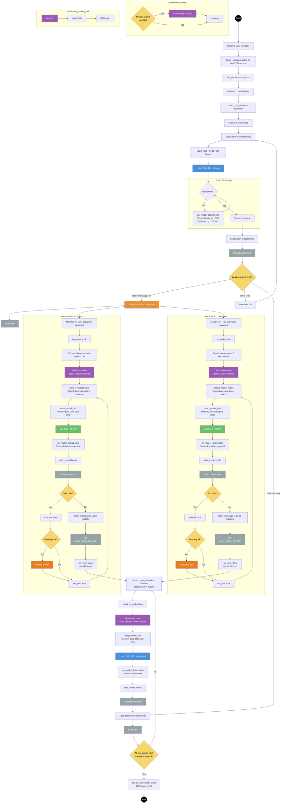

# Agent Teams

**Source:** `app/agent/mode/team/`

Multi-agent teams coordinate a lead agent with N specialized member agents. The lead plans, delegates, and synthesizes. Members work independently on assigned tasks and report back.

---

## Architecture overview

```
AgentTeam
├── name: str                ← team identity
├── lead: TeamLead           ← receives user messages, plans, delegates
├── members: {name: TeamMember, ...}   ← specialized workers
└── mailbox: TeamMailbox     ← per-agent asyncio.Queue inboxes

TeamMemberBase (ABC)          ← shared worker infrastructure
├── TeamLead                 ← no safety-net, skips user-only inbox persistence
└── TeamMember               ← safety-net auto-reply, error notification to lead
```

`TeamLead` and `TeamMember` both extend `TeamMemberBase`, which wraps an `Agent`. Agents are activated on-demand via `_run_activation()` when messages arrive in their mailbox. Each role overrides template methods for role-specific behavior.

All streaming goes to a **single in-memory stream key** (the lead's `session_id`), tagged by `agent` field. The frontend subscribes once and receives a unified event feed.

---

## Configuration

Each agent is a `.md` file in `OPENAGENTD_CONFIG_DIR/agents/`. Exactly one must have `role: lead`.

```markdown
---
name: orchestrator
role: lead
model: zai:glm-5v-turbo   # multimodal recommended — lead handles user input
tools: [read, ls]
---

You are the orchestrator. Break down tasks, delegate to members, synthesize results.
```

```markdown
---
name: explorer
role: member
model: zai:glm-5-turbo
tools: [web_search, web_fetch, glob, grep]
---

You are an explorer. Find information, summarize findings.
```

`team_message` is injected automatically into every agent — do not list it in `tools:`.

---

## Lifecycle

### Startup

```python
team = AgentTeam(name="task-force", lead=lead_member, members={...})
await team.start()
# → each member: _ensure_db_session(), mailbox.register(name)
# → install on_message callback for mailbox
```

### Handling a user message

```python
session_id = await team.handle_user_message(content="Research X", session_id=new_uuid)
# client subscribes to GET /api/team/stream/{session_id}
```

Inside `handle_user_message`:
1. Update lead's `session_id` + ensure DB session row exists.
2. **Restore or rotate member sessions** — queries `ChatSession` rows matching `parent_session_id = lead_uuid` and `agent_name`. Only sessions belonging to the same team and lead are reused.
3. Save `HumanMessage` to lead's DB session.
4. Link all member sessions to lead via `parent_session_id` FK.
5. `stream_store.init_turn(session_id)` — synchronously, before delivering message (no race condition).
6. Set `_has_active_turn = True`.
7. Put `Message(from_agent="user", content="[user]: {content}")` in lead's mailbox.

### Continuing the prior assistant turn

```python
session_id = await team.handle_continue(existing_session_id)
# client subscribes to GET /api/team/stream/{session_id}
```

`/continue` resumes from the last assistant message **without** appending a new user turn. It's the entry point for the `POST /api/team/commands` route with `command: "continue"` — used after the user pressed Stop or the server restarted mid-stream.

Inside `handle_continue`:
1. Validate the session id parses, exists in DB, and (when `ChatSession.agent_name` is set) belongs to this lead.
2. Heal unresolved tool calls by inserting synthetic tool results that say execution was interrupted before a result was recorded.
3. Load history via `get_messages_for_llm` — the same view the agent loop will pass to the LLM — and validate the tail. A trailing `AssistantMessage` must have no unresolved `tool_calls`; empty content is still allowed so `/continue` can recover when the model was stopped before visible text arrived. A trailing `ToolMessage` is allowed only when it links to a prior assistant tool call, including synthetic interrupted results. If Stop left a trailing interrupted, thinking-only assistant row, that row is deleted and the previous tail is re-evaluated. All precondition failures raise `ContinuePreconditionError` (HTTP 409); the team object is untouched on failure.
4. Realign the lead onto this session (skip the user-message persistence and inbox delivery steps from `handle_user_message`).
5. `stream_store.init_turn(session_id)`, set `_has_active_turn = True`, and persist a hidden user directive row. The directive tells the model to continue exactly where the prior response stopped, is hidden from the UI via `extra["hidden_from_user"]`, skipped by summarization via `extra["hidden_from_summary"]`, and kept in LLM context (`exclude_from_context=False`) so the persisted history matches the provider payload.
6. Call `lead.activate_for_continuation()` — atomic state guard inside; raises `AlreadyWorkingError` if the lead is already mid-turn, which `handle_continue` catches and rethrows as `ContinuePreconditionError`.

The activation differs from `_maybe_activate` only in that it sets `is_continuation=True` on `_run_activation`, which skips the inbox drain/persist/SSE-emit steps and installs `ContinuationHook` for the agent run. The hook does one one-shot job:

- **`after_model`**: stamps `extra["is_continuation"] = True` on the resulting first assistant row so the frontend can render it tight against the prior bubble. The provider request shape is unchanged for prompt-cache compatibility; continuation reasoning may still be persisted for audit, but live `thinking` SSE events are suppressed and `GET /api/team/{id}/history` omits `reasoning_content` for continuation rows.

Subsequent assistant messages in the same `/continue` run (e.g. after a tool call) are not stamped; only the very first one is a continuation of the prior turn.

#### Interrupted-turn marker

`POST /api/team/chat` with `interrupt=true` cancels the running turn and writes `extra["interrupted"] = true` onto the most recent assistant row via `_mark_last_assistant_interrupted`. The marker rides on `extra` rather than `content` so the LLM never sees the string `"interrupted"` on the next turn (it would cause the model to restart instead of continue — earlier code that appended `" [interrupted]"` to `content` directly caused this regression).

### Activation

On each message arrival, `_maybe_activate()` spawns a one-shot `_run_activation()` task:

```
message arrives in mailbox
│
└─ on_message callback fires (from mailbox.send/broadcast)
   │
   └─ _maybe_activate()
      ├─ if state == "working" → message is already in queue; TeamInboxHook
      │  will drain it before the next LLM call → return
      └─ else:
           state = "working"    ← set synchronously before create_task so that
           │                       _try_emit_done() never sees a stale "idle"
           └─ _active_task = create_task(_run_activation())

_run_activation() ← one-shot task
│
├─ _cancel_event.clear()
│
├─ drain all queued messages (receive_nowait loop)
│   └─ if inbox empty → state = "idle"; return  ← spurious wakeup, no agent.run()
│
├─ emit agent_status working
│
├─ await _handle_messages(pending_messages)
│    ├─ load DB history (get_messages_for_llm)
│    ├─ format inbox messages as HumanMessages with [sender]: prefix
│    ├─ run_messages = history + inbox_as_chat
                │    ├─ build hooks: [AgentTeamProtocolHook, TeamInboxHook, StreamPublisherHook, (TitleGenerationHook — lead only), SummarizationHook]
│    │     TeamInboxHook.before_model(): drains mailbox between agent loop iterations,
│    │     persists new messages, emits inbox SSE, appends to state.messages, and
│    │     returns an updated ModelRequest so the current LLM call sees messages
│    │     that arrived while tools were executing.
│    ├─ get injected team tools
│    ├─ set_sandbox(workspace_dir(lead_session_id))
│    └─ await agent.run(run_messages, hooks=hooks, injected_tools=injected)
│
├─ after agent.run()
│    └─ TeamMember only: if the member ended without `<sleep>`/`team_message`
│       while it still has open assigned/claimed todos, enqueue one hidden
│       `[system]` reminder telling it to continue, report via `team_message`,
│       or sleep. The nudge is bounded per task to avoid loops.
├─ (on error) _on_turn_error()
│    ├─ Provider auth / unconfigured-model failures: push `agent_not_configured` to the lead stream
│    ├─ TeamMember: notify lead via mailbox ("[name]: System error — temporarily unavailable…")
│    └─ TeamLead: push typed ErrorEvent to stream (SSE `error` event) for non-auth failures
│
└─ finally:
    _on_turn_finally()       ← TeamMember: clear _current_task_id
    state = "idle"
    emit agent_status idle

    ── late-inbox check ──────────────────────────────────────────────────
    │  A message can arrive in the mailbox while agent.run() is executing
    │  its last LLM call (e.g. a peer replies while streaming <sleep>).
    │  TeamInboxHook never fires again after agent.run() breaks, so the
    │  message would be lost without this check.
    │
    if inbox not empty:
        _maybe_activate()   ← sets state="working" synchronously, spawns new task
                               _try_emit_done() below sees "working" → will not fire done
    ── end late-inbox check ──────────────────────────────────────────────

    team._try_emit_done()   ← emits "done" only if ALL live agents are "idle"
```

### Shutdown

```python
await team.stop()
# → cancels all active _active_task tasks (5s timeout)
# → deregisters agents from mailbox
```

### Live config — drift detection (no team reload)

**Files:** `app/agent/drift.py` (`ConfigStamp`, `stamp_agent_files`, `detect_drift` — leaf module imported by both sides), `app/agent/loader.py`, `app/agent/mode/team/member.py`

CRUD routes (`/api/agents`, `/api/skills`, `/api/mcp/*`) write to disk
and **do not** restart the team. Each member stamps the mtimes of its
own `.md`, `mcp.json`, and every referenced `SKILL.md` in
`agent.config_stamp` at build time. At end-of-turn the wrapper detects
drift; on the next `_run_activation()` it re-parses the `.md` and swaps
`self.agent` in place (model, tools, prompt, MCP). The `TeamMember`
wrapper, mailbox binding, and `session_id` are preserved. Parse failures
keep the previous agent and re-stamp to avoid looping.

External callers that need fresh frontmatter without waiting for the
next turn (e.g. `GET /team/agents`) call the public
`TeamMemberBase.refresh_if_dirty()` — `team_manager.refresh_idle_agents()`
loops over idle members and applies it. Working members are skipped to
avoid racing `agent.run()`. See
`app/agent/mode/team/member.py:refresh_if_dirty` and
`app/services/team_manager.py:refresh_idle_agents`.

Adding/removing **member agent files** at runtime is handled by
`team_manager.refresh_blueprints()`, also called from `GET /team/agents`:
it scans the agents directory for that team's mode, registers new
`MemberBlueprint`s for previously unseen `.md` files, and drops
blueprints whose source file vanished — unless an instance is still
live in the roster, in which case the blueprint is kept so an in-flight
conversation can still address the agent by handle. Lead lifecycle
remains out of scope; changing the lead still requires
`team_manager.reload()`.

### `team_manager` — lifecycle + admin reload

**File:** `app/services/team_manager.py`

`team_manager` is the module-level wrapper around the running
`AgentTeam`. Teams build **lazily** on first request and evict after an
idle window:

* Default team — 1 h idle (`_DEFAULT_TEAM_IDLE_SECONDS`)
* Coding teams — 30 min idle (`_CODING_TEAM_IDLE_SECONDS`), one per workspace

`validate_agents_dir()` runs at lifespan startup so a malformed agent
`.md` fails the server boot instead of the first chat request; it does
**not** build a team. `reload()` is retained as an admin/test escape
hatch — it stops the live team, rebuilds from disk via
`load_team_from_dir`, and returns a `TeamDiff`. Drift detection covers
hot edits to individual agent files; `reload()` is not called on writes.

```python
team_manager.validate_agents_dir()              # lifespan startup (parse-only)
team = await team_manager.get_or_start_team()   # first chat / scheduler fire
team_manager.invalidate_skill_cache()           # after a skill write
diff = await team_manager.reload()              # admin/test only
await team_manager.stop()                       # lifespan shutdown
```

Eviction is opportunistic (no background timer) — the next
`get_or_start_*` call sweeps expired teams. Working teams (any member
in `state="working"`) are never evicted. Serial execution is enforced
via `asyncio.Lock`.

---

## Mailbox

**File:** `mailbox.py`

Per-agent `asyncio.Queue` inboxes. Accepts an optional `on_message` callback that fires after every `send()` or `broadcast()` to trigger agent activation.

```python
async def on_message_callback(agent_name: str) -> None:
    """Fire activation for this agent."""

mailbox = TeamMailbox(on_message=on_message_callback)
mailbox.register("explorer")   # create inbox (idempotent)

# Point-to-point
await mailbox.send(to="explorer", message=Message(from_agent="lead", content="..."))
# → fires on_message("explorer") before returning

# Broadcast — delivers to all inboxes except sender's
await mailbox.broadcast(Message(from_agent="lead", content="[broadcast]: ..."))
# → delivers/activates recipients concurrently, then returns after all finish

# Receive (blocking)
msg = await mailbox.receive("explorer")
```

| Method | Notes |
|--------|-------|
| `register(name)` | Create inbox (idempotent). |
| `deregister(name)` | Remove inbox; undelivered messages discarded. |
| `send(to, message)` | Single delivery. Raises `KeyError` if not registered. Fires `on_message` callback. |
| `broadcast(message)` | Copies to all except sender. Marks `is_broadcast=True`. Delivers and fires `on_message` concurrently per recipient. |
| `receive(name)` | Async, blocks until message. |
| `receive_nowait(name)` | Sync, raises `asyncio.QueueEmpty` if empty. |
| `inbox_empty(name)` | Non-blocking check. |

Message fields: `id`, `from_agent`, `to_agent` (None = broadcast), `content`, `is_broadcast`, `timestamp`.

---

## Team communication tools

**Files:** `app/agent/mode/team/tools.py`, `app/agent/mode/team/manage.py`

Injected automatically — do not list in `tools:`.

| Factory | Returns | For |
|---------|---------|-----|
| `make_team_message_tool(mailbox, agent_name, role)` | `[team_message]` | All team agents (lead + members) |
| `make_team_manage_tool(team)` | `[team_manage]` | Lead only |

### `team_message` tool

```
team_message(to: list[str], content: str) -> str
```

- `to`: list of exact recipient names from the team roster
- `content`: work output, instructions, questions, requested progress, or coordination blockers; no routine chatter
- Self-messaging is silently dropped (agent cannot message itself)
- Recipients are validated against `mailbox.registered_agents` — unknown names return an error string listing available agents
- The sender prefix `[agent_name]: ` is added automatically — agents must not include it in `content`

The tool description is **role-specific** via the `role` parameter (`"lead"` or `"member"`):
- **Lead**: delegation, instructions, scope changes, and status requests
- **Member**: work delivery, peer handoffs, blockers, and unblocking questions; it also states that plain text is discarded

Field descriptions cover audience, automatic sender prefixes, useful message categories, and routine-chatter avoidance. The team protocol reinforces routing and idle behavior.

### `team_manage` tool (lead-only)

```
team_manage(action: "list"|"spawn"|"dismiss", members: list[str]) -> str
```

The lead manages the live roster with one batch-capable tool.

- `action="list"`: pass `members=[]`; returns current live handles and the spawnable blueprint catalogue. This is the discovery path because the cache-stable system prompt does not embed the dynamic roster.
- `action="spawn"`: each entry in `members` is either a bare blueprint name (`"executor"`) or an explicit handle (`"executor#1"`). Bare names allocate the next available `#N`; explicit handles restore/reuse that exact instance history.
- `action="dismiss"`: each entry in `members` must be an explicit live handle (`"executor#1"`). Dismiss removes the in-memory member from the roster and preserves DB history. The lead protocol **keeps members alive by default** and reuses live handles across turns (a warm member preserves its prompt cache); dismiss is reserved for clearly-finished members or roster cleanup.
- Partial success is allowed; the return string groups `Spawned`, `Dismissed`, `Already live`, `Not live`, and `Errors` entries.

Spawned members keep their blueprint prompt, but team protocol injects the concrete runtime identity (`You are executor#N`) on every model call. Config hot-reload preserves that handle so parallel instances do not collapse back to the blueprint name.

Examples:

```python
team_manage(action="list", members=[])
team_manage(action="spawn", members=["executor", "executor", "explorer"])
team_manage(action="spawn", members=["executor#1"])  # restore exact history
team_manage(action="dismiss", members=["executor#1", "explorer#1"])
```

Related protocol invariants in the same file:

- **Members must verify before claiming.** After a tool call, members must read the result and never report success on a tool error. After mutating state (file write, etc.) the protocol asks for a cheap follow-up read (`ls`, `read`) before reporting completion. Catches LLM hallucination after a failed tool call.
- **Lead must sanity-check claims before promising "done".** When a member reports it wrote a file at path X, lead is instructed to verify with a cheap read when feasible.

> **Robustness contract:** `_build_agent` in `app/agent/loader.py` warn-and-skips unknown tool / MCP names instead of raising. This keeps blueprint loads resilient if a user-added override references a capability that later disappears (for example, an MCP server removed from `mcp.json`).

---

## SSE events (team-specific)

All events carry an `agent` field to identify the source.

| Event | Who emits | Payload |
|-------|-----------|---------|
| `agent_status` | `AgentTeam._emit()` | `{agent, status: "idle"\|"working"\|"offline"\|"error"}` |
| `inbox` | `TeamInboxHook.before_model()` + `_run_activation()` | `{agent, content, from_agent}` |
| `error` | `TeamLead._on_turn_error()` | `{message, metadata: {agent, exception}}` — emitted only when the **lead** fails; member failures route through the mailbox instead |
| `done` | `AgentTeam._try_emit_done()` | `{}` |
| `message`, `thinking`, `tool_call`, `tool_start`, `tool_output_delta`, `tool_end`, `usage` | `StreamPublisherHook` | Same as single-agent, plus `agent` field |

> **Note:** `agent_done` was removed. `agent_status: idle` is the sole signal that an individual live agent has finished its turn. Dismissed members emit/render as `offline`; `done` preserves `offline` and `error` rather than reviving them. The frontend uses `agent_status` for per-agent indicators and `done` for the team-wide "all idle" state.
>
> `agent_status` is stored as a latest-wins `{agent: status}` map in the stream state blob and replayed on reconnect **before** any thinking/message events. This ensures a client that refreshes mid-turn sees per-agent working indicators light up before text tokens arrive. `thinking` and `message` replay is also per-agent — see [`architecture.md`](../architecture.md) for the state schema.

Team rosters are scoped to a lead session. Starting a fresh session resets the live UI roster to the lead only; previous members are restored only when that session history is loaded. Pressing stop during a turn records a short member-to-lead stop notice and interrupts running members; they remain live and settle back to `agent_status: idle`. Only explicit `team_manage(action="dismiss")` emits `agent_status: offline` and removes a member from the live roster.

Member failures follow the same lead-context rule: a failed member emits `agent_status: error` and sends a mailbox notice to the lead so the next lead turn can reassign or retry the work instead of waiting silently.

When a member is stopped or fails, unfinished todos assigned to or claimed by that member are unassigned; claimed `in_progress` todos are also reset to `pending` so the lead can reassign them.

### `_try_emit_done` logic

```python
if self._has_active_turn and lead.state == "idle" and all(m.state == "idle" for m in live_members):
    _has_active_turn = False
    push_event(session_id, done_event)
    mark_done(session_id)
```

Called from every agent's `_run_activation` finally block — fires at most once per turn.

---

## Database layout

| Table | What's stored |
|-------|-------------|
| `chat_sessions` (lead, top-level) | `parent_session_id IS NULL` — the lead row for a team session |
| `chat_sessions` (member, child) | `parent_session_id=lead_uuid` — one per active team member |
| `session_messages` | Each agent's messages in its own session |

There is no longer a ``session_type`` column. Top-level sessions (team leads, scheduled-task sessions) are identified by `parent_session_id IS NULL`; team-member sessions are children of their lead via the FK.

Lead sessions may carry per-session `model` and `thinking_level` overrides. Each user `session_messages.extra` also stores the effective model used for that turn so history shows the original model even after settings change.

`GET /api/team/{session_id}/history` queries sub-sessions by `parent_session_id` — not live team state. Works correctly for historical sessions, including orphaned members.

---

## Sandbox scoping

Team members share one sandbox workspace. Normal sessions use `{OPENAGENTD_WORKSPACE_DIR}/{lead_session_id}/`; coding sessions use the selected project directory exactly. All members of the same team write into that shared root. The sandbox itself uses a denylist (see [`tools.md`](tools.md#filesystem-builtinfilesystem)).

Coding mode loads its team from `{OPENAGENTD_CONFIG_DIR}/agents/coding/`. Teams are cached per resolved workspace, so multiple workspaces can run concurrently; concurrent sends to the same workspace are admitted via the lead's mailbox (queued when the lead is working, activated when idle) — same model as normal mode. Idle coding teams are stopped opportunistically. A root `AGENTS.md` is injected into each model call when present and under the size limit. Coding sessions persist `mode` and `workspace` so `/coding/{session_id}` can restore the project context directly.

```python
from app.core.paths import workspace_dir

workspace = str(workspace_dir(lead_session_id))
token = set_sandbox(SandboxConfig(workspace=workspace))
try:
    await agent.run(...)
finally:
    _sandbox_ctx.reset(token)
```

---

## Interrupt flow

### Via HTTP (`POST /api/team/chat`)

`POST /api/team/chat` uses the same `ChatForm` model as single-agent chat. When `interrupt=true`:

```
POST /api/team/chat  interrupt=true  session_id=<lead_sid>
│
├─ route handler calls team.handle_user_message(..., interrupt=True)
└─ returns {"status": "interrupted", "session_id": "..."}
```

### Inside `handle_user_message`

```
team.handle_user_message(content="...", session_id=sid, interrupt=True)
│
├─ find all members with state == "working"
├─ member._cancel_event.set()   ← agent loop breaks mid-stream or cancels tools
├─ board.reset_for_interrupt()  ← non-completed tasks → pending
└─ deliver new message to lead inbox
```

The `_cancel_event` is cleared at the top of each `_worker_loop` iteration — a stale cancel doesn't abort the next run.

### What happens to in-flight tool calls

When `_cancel_event` fires during a member's tool execution, `_gather_or_cancel()` in the agent loop handles it:

- **Tools that already completed** keep their real results — no data is lost.
- **Tools still running** are cancelled via `asyncio.Task.cancel()` and produce `ToolMessage(content="Cancelled by user.")`.
- The loop breaks after appending all tool results — no further LLM iterations.
- After `agent.run()` returns, the member appends `[interrupted]` to the last assistant message in DB.

---

## System prompt protocol hook

**File:** `app/agent/mode/team/hooks/team_prompt.py` — `AgentTeamProtocolHook`

Injected in `TeamMemberBase._handle_messages()` before every `agent.run()`. The hook resolves the `TeamMemberBase` instance and calls `member.build_protocol(base_prompt, team)` — each role class assembles its own protocol. No role branching in the hook.

Protocol constants (`COMMUNICATION_RULES`, `MESSAGE_FORMAT`, `LEAD_PROTOCOL`, `MEMBER_PROTOCOL`) live in `app/agent/mode/team/member.py`. Member protocol templates use `{lead_name}` placeholders — `build_protocol()` fills them with the actual lead name at runtime, so protocol examples always reference the correct lead regardless of config.

### What each role injects

| Section | `TeamLead.build_protocol()` | `TeamMember.build_protocol()` |
|---------|------|---------|
| Communication rules | plain text is user-visible and reserved for the final answer, plus one optional brief progress note after delegation; coordination via `team_message` tool | `team_message` is the ONLY way to send results — addressed to **any teammate** (peer or lead), not lead-only; no plain text output; no social messages; idle/waiting/done → respond exactly `<sleep>` (no tool calls) |
| Message format | `[name]: content`, `[user]: content` | `[{lead_name}]: content` (lead), `[name]: content` (peers) |
| Delegation sizing | handle small/quick tasks yourself — spawning has latency + token cost; delegate only substantial work (role-fit, parallel, context-heavy, or a sustained multi-step workstream); prefer reusing a live member | n/a |
| Workflow | assess → discover roster → spawn/restore → create todos with concrete `assigned_to` handles and `dependencies` → instruct unblocked owners → wait → verify → synthesise | claim assigned todo → work and verify → mark complete → send the result directly to its consumer → `<sleep>` |

The protocol is static per session (no dynamic roster — see [`hooks.md`](hooks.md#agentteamprotocolhook)). Tool-mechanical rules (one call per audience, no name prefix in content, work-output-only content) are in the `team_message` tool description itself — not in the protocol constants. The tool description is role-specific: lead gets delegation-focused wording, members get delivery-focused wording.

### Usage

```python
from app.agent.mode.team.hooks.team_prompt import AgentTeamProtocolHook

hook = AgentTeamProtocolHook(team=team, agent_name="explorer")
await agent.run(messages, hooks=[hook, publisher_hook, ...])
```

---

## Provider-specific pitfalls

### Gemini: Role alternation violations

Team message history can violate Gemini's strict `user → model → user` alternation:

- **Consecutive HumanMessages**: Inbox messages (from lead/teammates) are appended as `HumanMessage`. If DB history ends with a `HumanMessage`, you get consecutive user turns. **Fix**: The same-role merging in the provider handles this.
- **Error**: `"Please ensure that function call turn comes immediately after a user turn or after a function response turn"` — means a `model` message with `functionCall` appeared after another `model` message.

---

## Architecture diagram

```mermaid
graph TB
    User([User]) -->|POST /api/team/chat| Route
    User -->|GET /api/team/{sid}/stream| StreamStore

    subgraph Backend
        Route["API Route\n─────────\nsave user msg to DB\ninit_turn(session_id)\nmailbox.send(lead)\nreturns 202"]

        subgraph AgentTeam["AgentTeam (starts at lifespan)"]
            Lead["Team Lead\n──────────────\nTeamLead(TeamMemberBase)\nStreamPublisherHook\nteam_message · team_manage\ntodo_manage"]

            subgraph Mailbox["TeamMailbox"]
                LI[lead inbox]
                RI[member inboxes]
            end

            subgraph TaskBoard["Todo board (todo_manage, asyncio.Lock)"]
                T1["task_1 · pending"]
                T2["task_2 · in_progress"]
            end

            Members["Member agents\n──────────────\nTeamMember(TeamMemberBase) (each)\nStreamPublisherHook\nteam_message · todo_manage"]
        end

        StreamStore["memory_stream_store\n─────────────────\nstate:{lead_sid}\nevents:{lead_sid}\nAll agents write here"]
    end

    Route -->|mailbox.send| LI
    Lead -->|team_message| RI
    Members -->|team_message| LI
    Lead <-->|todo_manage| TaskBoard
    Members <-->|todo_manage| TaskBoard
    Lead -->|StreamPublisherHook| StreamStore
    Members -->|StreamPublisherHook| StreamStore
    StreamStore -->|SSE| User
```

## Server restart during active work

If the server restarts while team members are actively working, the shutdown and recovery behave as follows.

### Shutdown sequence

The lifespan handler (`app/api/app.py`) calls `AgentTeam.stop()`:
1. Waits up to 5 seconds for each active task to complete or cancels if still running.
2. Deregisters agents from the mailbox.
3. Clears in-memory stream state.

**`mark_done()` is never called during shutdown** — the turn state freezes mid-flight.

### What survives vs. what is lost

| State | Persisted? | Notes |
|-------|-----------|-------|
| User messages & completed turns | Yes (DB) | Safe — fully checkpointed |
| Session records & conversation history | Yes (DB) | Safe — `chat_sessions` + `session_messages` rows intact |
| Mailbox messages (`asyncio.Queue`) | **No** (in-memory) | **Lost** — pending tasks the lead assigned but members haven't processed are gone |
| `_has_active_turn` flag | **No** (in-memory) | **Resets to `False`** on restart; `_try_emit_done()` won't fire for the old turn |
| Active task state (`_active_task`) | **No** (in-memory) | **Lost** — agents are re-created without any active tasks on restart |
| Partial LLM streaming responses | **No** | **Lost** — mid-stream assistant text not yet checkpointed |
| Task board state (`TeamTaskBoard`) | **No** (in-memory) | **Lost** — all task statuses, assignments, dependencies gone |
| `is_streaming` flag (in-memory) | **Stuck as `true`** | Never cleared; frontend may hang waiting for a `done` event that never comes |

### After restart — what the user sees

1. **Session restoration works** — `handle_user_message()` (`team.py`) queries DB for `ChatSession` rows with matching `parent_session_id` and `agent_name` and reuses those session IDs. Conversation history is preserved.

2. **No work resumes** — the team reinitializes with `_has_active_turn = False`, empty mailbox queues, and an empty task board. Nobody remembers what was in-flight. The lead doesn't know it had delegated work. Members don't know they had pending tasks.

3. **Frontend gets stuck** — `is_streaming` from the previous turn was never cleared. The client waits indefinitely for a `done` event. The user must send a new message or reload to recover.

### Recovery path

The user sends a new message → new turn starts → lead sees conversation history from DB → lead can pick up where it left off based on context. This depends entirely on LLM reasoning — there is no programmatic recovery of in-flight work.

### Gaps to address

| Gap | Impact | Potential fix |
|-----|--------|--------------|
| `is_streaming` frozen on restart | Frontend hangs forever | Auto-expire turn state after configurable timeout; or clear stale flags at startup |
| `_has_active_turn` not persisted | `mark_done()` never called for interrupted turn | Store flag in DB; restore on startup |
| Mailbox not persisted | Pending delegated tasks lost | Persist `team_message()` calls to DB; replay on restart |
| Task board not persisted | All task state lost | Persist board to DB; restore on startup |
| Partial assistant messages | Incomplete text in DB | Append `[interrupted — server restart]` marker during shutdown |

---

## Agent flow diagram


```mermaid
graph TD
    START((Start)) --> RECV[Receive User Message]
    RECV --> SAVE_MSG[Save HumanMessage to Lead DB session]
    SAVE_MSG --> INIT[init_turn in stream_store]
    INIT --> DELIVER[Deliver to Lead Mailbox]

    DELIVER --> LEAD_ACTIVATE[Lead: _run_activation spawned]
    LEAD_ACTIVATE --> LEAD_ON_WAKE[Lead: on_wake hook]
    LEAD_ON_WAKE --> LEAD_BEFORE_MODEL[Lead: before_model hooks]

    subgraph lead_before_model [Lead before_model]
        L_BM_SUMMARIZE{Prompt tokens<br/>ge 30k?}
        L_BM_SUMMARIZE -->|Yes| L_SUMMARIZE[Summarize via LLM]
        L_SUMMARIZE --> L_BM_DONE[Continue]
        L_BM_SUMMARIZE -->|No| L_BM_DONE
    end

    LEAD_BEFORE_MODEL --> LEAD_WRAP_MODEL[Lead: wrap_model_call hooks]

    subgraph lead_wrap_model [Lead wrap_model_call]
        L_MEMORY[Memory] --> L_DATE[Inject Date]
        L_DATE --> L_OTEL[OTel span]
    end

    LEAD_WRAP_MODEL --> LEAD_LLM[Lead: Call LLM - stream]

    subgraph lead_streaming [Lead Streaming]
        L_CHUNK{Next chunk?}
        L_CHUNK -->|Yes| L_DELTA[on_model_delta hooks<br/>StreamPublisher - SSE<br/>SessionLog - JSONL]
        L_DELTA --> L_CHUNK
        L_CHUNK -->|No| L_STREAM_END[Stream complete]
    end

    LEAD_LLM --> L_CHUNK
    L_STREAM_END --> LEAD_AFTER_MODEL[Lead: after_model hooks]
    LEAD_AFTER_MODEL --> LEAD_CHECKPOINT[Checkpointer sync]

    LEAD_CHECKPOINT --> LEAD_DECISION{Lead response type?}
    LEAD_DECISION -->|team_message tool| DELEGATE[Delegate tasks to Members]
    LEAD_DECISION -->|other tools| LEAD_TOOL_EXEC[Execute tools]
    LEAD_TOOL_EXEC --> LEAD_BEFORE_MODEL
    LEAD_DECISION -->|final text only| LEAD_FINAL[Lead produces final answer]

    DELEGATE --> LEAD_IDLE[Lead: idle]
    DELEGATE --> M1_ACTIVATE[Member A: _run_activation spawned]
    DELEGATE --> M2_ACTIVATE[Member B: _run_activation spawned]

    subgraph member_a [Member A - concurrent]
        M1_ACTIVATE --> M1_WAKE[on_wake hook]
        M1_WAKE --> M1_PERSIST[Persist inbox msg to A session DB]
        M1_PERSIST --> M1_SSE_INBOX[SSE inbox event<br/>agent_status: working]
        M1_SSE_INBOX --> M1_BEFORE_MODEL[before_model hooks<br/>TeamInboxHook drains mailbox]
        M1_BEFORE_MODEL --> M1_WRAP[wrap_model_call<br/>Memory plus Date plus OTel]
        M1_WRAP --> M1_LLM[Call LLM - stream]
        M1_LLM --> M1_DELTA[on_model_delta hooks<br/>StreamPublisher agent=A]
        M1_DELTA --> M1_AFTER[after_model hooks]
        M1_AFTER --> M1_CHECKPOINT_A[Checkpointer sync]
        M1_CHECKPOINT_A --> M1_TOOL_D{Tool calls?}
        M1_TOOL_D -->|Yes| M1_TOOLS[Execute tools]
        M1_TOOLS --> M1_OFFLOAD{Result gt 8k?}
        M1_OFFLOAD -->|Yes| M1_DISK[Offload to disk]
        M1_OFFLOAD -->|No| M1_TOOL_DONE[tool_end SSE]
        M1_DISK --> M1_TOOL_DONE
        M1_TOOL_DONE --> M1_BEFORE_MODEL
        M1_TOOL_D -->|No| M1_REPLY[team_message to Lead mailbox]
        M1_REPLY --> M1_IDLE[idle<br/>agent_status: idle SSE]
        M1_IDLE --> M1_TRY_DONE[_try_emit_done<br/>not all idle yet]
    end

    subgraph member_b [Member B - concurrent]
        M2_ACTIVATE --> M2_WAKE[on_wake hook]
        M2_WAKE --> M2_PERSIST[Persist inbox msg to B session DB]
        M2_PERSIST --> M2_SSE_INBOX[SSE inbox event<br/>agent_status: working]
        M2_SSE_INBOX --> M2_BEFORE_MODEL[before_model hooks<br/>TeamInboxHook drains mailbox]
        M2_BEFORE_MODEL --> M2_WRAP[wrap_model_call<br/>Memory plus Date plus OTel]
        M2_WRAP --> M2_LLM[Call LLM - stream]
        M2_LLM --> M2_DELTA[on_model_delta hooks<br/>StreamPublisher agent=B]
        M2_DELTA --> M2_AFTER[after_model hooks]
        M2_AFTER --> M2_CHECKPOINT_A[Checkpointer sync]
        M2_CHECKPOINT_A --> M2_TOOL_D{Tool calls?}
        M2_TOOL_D -->|Yes| M2_TOOLS[Execute tools]
        M2_TOOLS --> M2_OFFLOAD{Result gt 8k?}
        M2_OFFLOAD -->|Yes| M2_DISK[Offload to disk]
        M2_OFFLOAD -->|No| M2_TOOL_DONE[tool_end SSE]
        M2_DISK --> M2_TOOL_DONE
        M2_TOOL_DONE --> M2_BEFORE_MODEL
        M2_TOOL_D -->|No| M2_REPLY[team_message to Lead mailbox]
        M2_REPLY --> M2_IDLE[idle<br/>agent_status: idle SSE]
        M2_IDLE --> M2_TRY_DONE[_try_emit_done<br/>not all idle yet]
    end

    M1_TRY_DONE --> LEAD_ACTIVATE2[Lead: _run_activation spawned<br/>results from A plus B]
    M2_TRY_DONE --> LEAD_ACTIVATE2

    LEAD_ACTIVATE2 --> LEAD_ON_WAKE2[Lead: on_wake hook]
    LEAD_ON_WAKE2 --> LEAD_INBOX2[TeamInboxHook<br/>drain mailbox - inject results]
    LEAD_INBOX2 --> LEAD_WRAP2[wrap_model_call<br/>Memory plus Date plus OTel]
    LEAD_WRAP2 --> LEAD_LLM2[Lead: Call LLM - synthesize]
    LEAD_LLM2 --> LEAD_DELTA2[on_model_delta hooks<br/>stream final answer]
    LEAD_DELTA2 --> LEAD_AFTER2[after_model hooks]
    LEAD_AFTER2 --> LEAD_CHECKPOINT2[Checkpointer sync]
    LEAD_CHECKPOINT2 --> LEAD_FINAL

    LEAD_FINAL --> LEAD_IDLE2[Lead: idle]
    LEAD_IDLE2 --> CHECK{All live agents idle?<br/>lead plus A plus B}
    CHECK -->|No| LEAD_ACTIVATE2
    CHECK -->|Yes| MARK_DONE[stream_store.mark_done<br/>SSE done event]
    MARK_DONE --> END((End))

    style START fill:#000,color:#fff
    style END fill:#000,color:#fff
    style LEAD_LLM fill:#4A90D9,color:#fff
    style LEAD_LLM2 fill:#4A90D9,color:#fff
    style M1_LLM fill:#6ABF69,color:#fff
    style M2_LLM fill:#6ABF69,color:#fff
    style DELEGATE fill:#E8913A,color:#fff
    style LEAD_DECISION fill:#F5D76E,color:#000
    style M1_TOOL_D fill:#F5D76E,color:#000
    style M2_TOOL_D fill:#F5D76E,color:#000
    style M1_OFFLOAD fill:#F5D76E,color:#000
    style M2_OFFLOAD fill:#F5D76E,color:#000
    style CHECK fill:#F5D76E,color:#000
    style L_BM_SUMMARIZE fill:#F5D76E,color:#000
    style L_MEMORY fill:#9B59B6,color:#fff
    style L_SUMMARIZE fill:#9B59B6,color:#fff
    style M1_SSE_INBOX fill:#9B59B6,color:#fff
    style M2_SSE_INBOX fill:#9B59B6,color:#fff
    style LEAD_INBOX2 fill:#9B59B6,color:#fff
    style LEAD_IDLE fill:#95A5A6,color:#fff
    style M1_IDLE fill:#95A5A6,color:#fff
    style M2_IDLE fill:#95A5A6,color:#fff
    style LEAD_IDLE2 fill:#95A5A6,color:#fff
    style LEAD_CHECKPOINT fill:#95A5A6,color:#fff
    style LEAD_CHECKPOINT2 fill:#95A5A6,color:#fff
    style M1_CHECKPOINT_A fill:#95A5A6,color:#fff
    style M2_CHECKPOINT_A fill:#95A5A6,color:#fff
    style M1_DISK fill:#E67E22,color:#fff
    style M2_DISK fill:#E67E22,color:#fff
```

| Color  | Meaning                                |
| ------ | -------------------------------------- |
| Blue   | Lead LLM call                          |
| Green  | Member LLM call                        |
| Orange | Delegation / offload                   |
| Purple | Prompt mutation — summarization, inbox |
| Gray   | Checkpointer sync / idle               |
| Yellow | Decision node                          |

---

## Deferred / not implemented

- Member hung timeout (configurable `member_timeout` — agents can be stuck in `_run_activation`)
- Multiple teams (one global team per process)
- Nested teams
- Turn state recovery after server restart (see section above)
- Migration tooling for team config changes (currently: breaking change = orphaned sessions)
