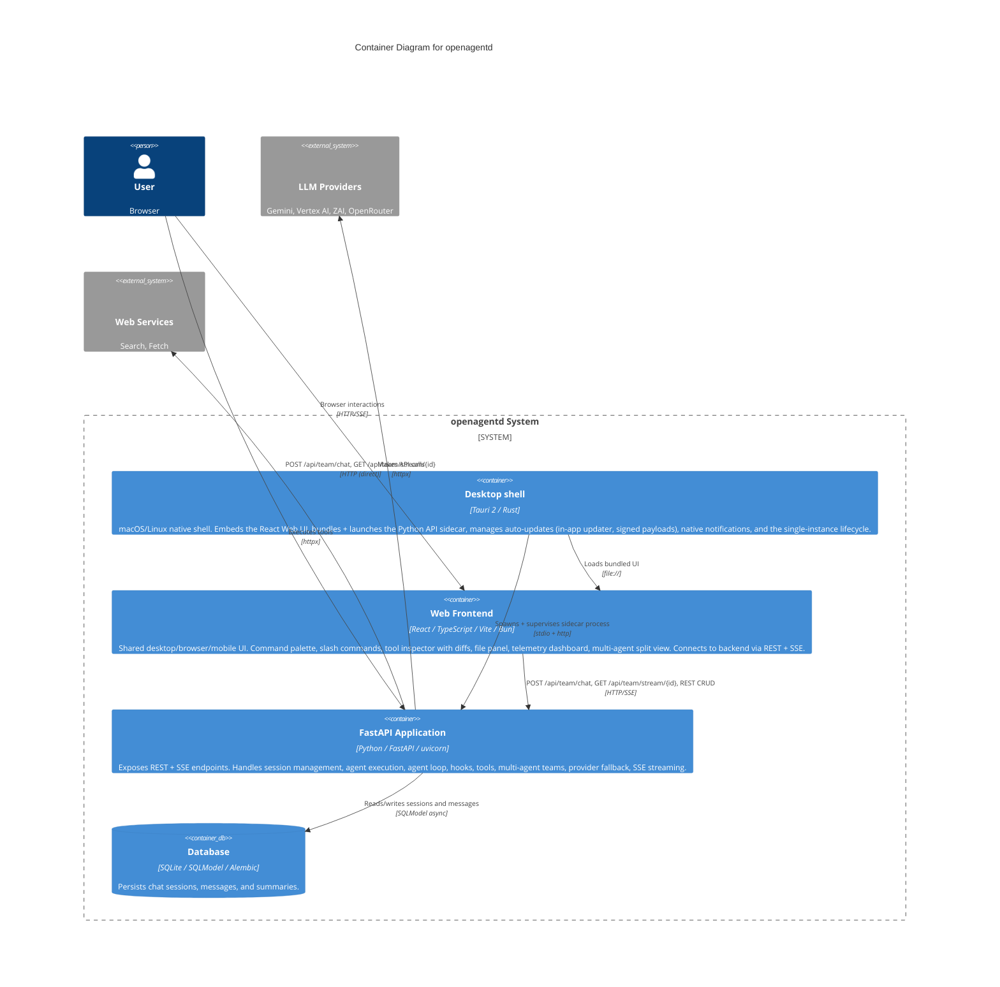
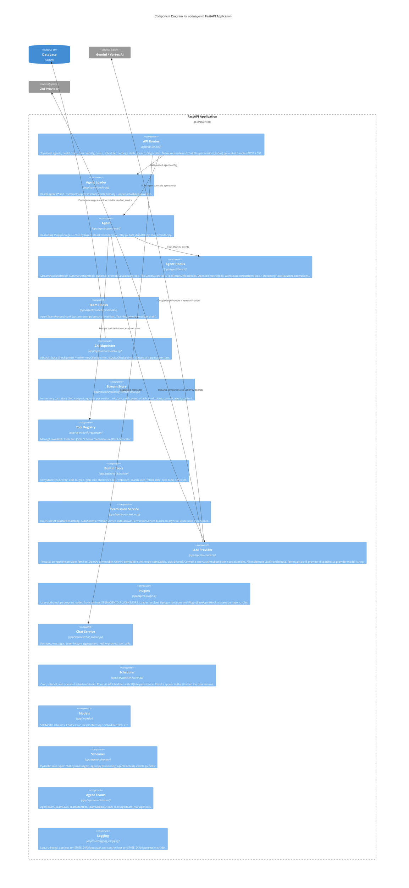
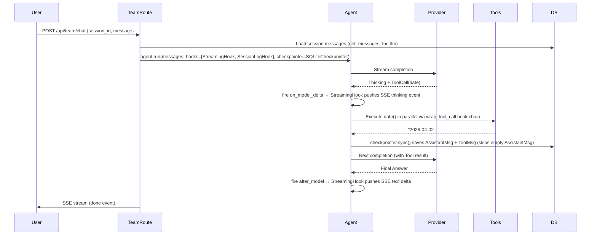

# openagentd Architecture (C4 Model)

This document provides a detailed technical overview of **openagentd** using the C4 model.

## 1. System Context Diagram (Level 1)
The highest level of abstraction, showing openagentd in its environment.

```mermaid
C4Context
    title System Context Diagram for openagentd

    Person(user, "User", "Operator on the same machine. Drives the agent via desktop app or web UI.")
    System(openagentd, "openagentd", "Local on-machine AI assistant. Desktop app (Tauri) embedding the web UI + FastAPI API sidecar. Multi-agent teams, persistent memory, web cockpit UI.")

    System_Boundary(llm_providers, "LLM providers (15)") {
        System_Ext(anthropic, "Anthropic", "Claude models")
        System_Ext(gemini, "Google Gemini", "Gemini Developer API")
        System_Ext(vertex, "Vertex AI", "Google Cloud Vertex AI")
        System_Ext(openai, "OpenAI", "OpenAI API")
        System_Ext(openrouter, "OpenRouter", "Model routing")
        System_Ext(bedrock, "AWS Bedrock", "Bedrock runtime")
        System_Ext(xai, "xAI", "Grok")
        System_Ext(deepseek, "DeepSeek", "DeepSeek models")
        System_Ext(nim, "NVIDIA NIM", "NIM endpoints")
        System_Ext(zai, "ZAI / GLM", "GLM models")
        System_Ext(copilot, "GitHub Copilot OAuth", "OAuth provider")
        System_Ext(codex, "OpenAI Codex OAuth", "OAuth provider")
        System_Ext(ollama, "Ollama", "Local models")
        System_Ext(router9, "Router9 (local)", "Local router")
        System_Ext(cliproxy, "CLIProxy (local)", "Local proxy")
    }

    System_Ext(web, "Web", "Search & fetch via tools")

    Rel(user, openagentd, "Sends messages, receives SSE stream", "HTTP/SSE")
    Rel(openagentd, llm_providers, "Sends prompts, receives completion/tools", "HTTPS/SSE")
    Rel(openagentd, web, "Searches and fetches content", "HTTPS")
```

---

## 2. Container Diagram (Level 2)
Zooming into the openagentd system to see its internal containers.


```mermaid
C4Container
    title Container Diagram for openagentd

    Person(user, "User", "Browser")

    System_Boundary(openagentd_boundary, "openagentd System") {
        Container(desktop, "Desktop shell", "Tauri 2 / Rust", "macOS/Linux native shell. Embeds the React Web UI, bundles + launches the Python API sidecar, manages auto-updates (in-app updater, signed payloads), native notifications, and the single-instance lifecycle.")
        Container(web, "Web Frontend", "React / TypeScript / Vite / Bun", "Shared desktop/browser/mobile UI. Command palette, slash commands, tool inspector with diffs, file panel, telemetry dashboard, multi-agent split view. Connects to backend via REST + SSE.")
        Container(api, "FastAPI Application", "Python / FastAPI / uvicorn", "Exposes REST + SSE endpoints. Handles session management, agent execution, agent loop, hooks, tools, multi-agent teams, provider fallback, SSE streaming.")
        ContainerDb(db, "Database", "SQLite / SQLModel / Alembic", "Persists chat sessions, messages, and summaries.")
    }

    System_Ext(llm_providers, "LLM Providers", "Gemini, Vertex AI, ZAI, OpenRouter", "HTTPS/SSE APIs")
    System_Ext(web_services, "Web Services", "Search, Fetch", "HTTPS")

    Rel(user, web, "Browser interactions", "HTTP/SSE")
    Rel(user, api, "POST /api/team/chat, GET /api/team/stream/{id}", "HTTP (direct)")
    Rel(desktop, api, "Spawns + supervises sidecar process", "stdio + http")
    Rel(desktop, web, "Loads bundled UI", "file://")
    Rel(web, api, "POST /api/team/chat, GET /api/team/stream/{id}, REST CRUD", "HTTP/SSE")
    Rel(api, db, "Reads/writes sessions and messages", "SQLModel async")
    Rel(api, llm_providers, "Makes API calls", "httpx")
    Rel(api, web_services, "Executes tools", "httpx")
```

---

## 3. Component Diagram (Level 3)
Zooming into the FastAPI Application container.


```mermaid
C4Component
    title Component Diagram for openagentd FastAPI Application

    ContainerDb(db, "Database", "SQLite")

    Container_Boundary(api_boundary, "FastAPI Application") {
        Component(routes, "API Routes", "app/api/routes/", "Top-level: agents, health, mcp, observability, quote, scheduler, settings, skills, speech, diagnostics. Team: routes/team/{chat,files,permissions,todos}.py — chat handles POST + SSE.")
        Component(agent_loader, "Agent Loader", "app/agent/loader.py", "Reads agents/*.md, constructs Agent instances with primary + optional fallback providers.")
        Component(agent, "Agent", "app/agent/agent_loop/", "Reasoning loop package — core.py (Agent class), streaming.py, retry.py, tool_dispatch.py, tool_executor.py.")
        Component(hooks, "Agent Hooks", "app/agent/hooks/", "StreamPublisherHook, SummarizationHook, dynamic_prompt, SessionLogHook, TitleGenerationHook, ToolResultOffloadHook, OpenTelemetryHook, WorkspaceInstructionsHook + StreamingHook (custom integrations).")
        Component(team_hooks, "Team Hooks", "app/agent/mode/team/hooks/", "AgentTeamProtocolHook (system-prompt protocol injection), TeamInboxHook (mailbox drain).")
        Component(checkpointer, "Checkpointer", "app/agent/checkpointer.py", "Abstract base Checkpointer + InMemoryCheckpointer / SQLiteCheckpointer. Synced at 4 points per turn.")
        Component(stream_store, "Stream Store", "app/services/memory_stream_store.py", "In-memory turn state blob + asyncio queues per session. init_turn, push_event, attach, mark_done, commit_agent_content.")
        Component(tool_registry, "Tool Registry", "app/agent/tools/registry.py", "Manages available tools and JSON Schema metadata via @tool decorator.")
        Component(builtin_tools, "Builtin Tools", "app/agent/tools/builtin/", "filesystem (read, write, edit, ls, grep, glob, rm), shell (shell, bg), web (web_search, web_fetch), date, skill, todo, schedule.")
        Component(permission, "Permission Service", "app/agent/permission.py", "Rule/Ruleset wildcard matching. AutoAllowPermissionService auto-allows; PermissionService blocks on asyncio.Future until user replies.")
        Component(provider, "LLM Provider", "app/agent/providers/", "Protocol-compatible provider families: OpenAI-compatible, Gemini-compatible, Anthropic-compatible, plus Bedrock Converse and OAuth/subscription specializations. All implement LLMProviderBase. factory.py:build_provider dispatches a 'provider:model' string.")
        Component(plugins, "Plugins", "app/agent/plugins/", "User-authored .py drop-ins loaded from settings.OPENAGENTD_PLUGINS_DIRS. Loader resolves @plugin functions and Plugin(BaseAgentHook) classes per (agent, role).")
        Component(chat_service, "Chat Service", "app/services/chat_service.py", "Sessions, messages, team-history aggregation, heal_orphaned_tool_calls.")
        Component(scheduler, "Scheduler", "app/services/scheduler.py", "Cron, interval, and one-shot scheduled tasks. Runs via APScheduler with SQLite persistence. Results appear in the UI when the user returns.")
        Component(models, "Models", "app/models/", "SQLModel schemas: ChatSession, SessionMessage, ScheduledTask, etc.")
        Component(schemas, "Schemas", "app/agent/schemas/", "Pydantic wire types: chat.py (messages), agent.py (RunConfig, AgentContext), events.py (SSE).")
        Component(teams, "Agent Teams", "app/agent/mode/team/", "AgentTeam, TeamLead, TeamMember, TeamMailbox, team_message/team_manage tools.")
        Component(logging, "Logging", "app/core/logging_config.py", "Loguru-based: app logs to {STATE_DIR}/logs/app/, per-session logs to {STATE_DIR}/logs/sessions/{id}/.")
    }

    System_Ext(gemini, "Gemini / Vertex AI")
    System_Ext(zai, "ZAI Provider")

    Rel(routes, agent_loader, "Gets loaded agent config")
    Rel(routes, agent, "Runs agent turns via agent.run()")
    Rel(agent, hooks, "Fires lifecycle events")
    Rel(agent, provider, "Streams completions via LLMProviderBase")
    Rel(agent, tool_registry, "Fetches tool definitions, executes tools")
    Rel(checkpointer, db, "Persists messages and tool results via chat_service")
    Rel(routes, chat_service, "Load/save messages")
    Rel(provider, gemini, "GoogleGenAIProvider / VertexAIProvider")
    Rel(provider, zai, "ZAIProvider")
```

---

## 4. In-Memory SSE Streaming Architecture

### Overview

Every chat turn is backed by an in-memory state blob + asyncio fan-out queues (one per SSE client). This enables:
- **Fire-and-forget POST**: `POST /api/team/chat` returns 202 immediately, agent runs in background.
- **Mid-turn reconnect**: clients that disconnect and reconnect receive buffered content.
- **Multi-client streaming**: multiple tabs can watch the same session simultaneously (single-process).

### Data Layout (per session_id)

`memory_stream_store._turns[session_id]` holds a `_TurnState` instance that accumulates per-agent content, thinking, tool calls, statuses, and subscriber queues (see `app/services/memory_stream_store.py:36`).

`content` and `thinking` are **per-agent buckets** — replay re-emits each bucket with the correct `agent` field so mid-turn refreshes in a team session route tokens to the right agent's stream. `agent_statuses` is a latest-wins map so reconnecting clients immediately know which agents are `idle` / `working` / `offline` / `error`.

The state blob holds **only unpersisted live content**. After `checkpointer.sync()` writes assistant/tool rows to the DB, `stream_store.commit_agent_content(session_id, agent)` drops `content[agent]`, `thinking[agent]`, and every `tool_calls` entry whose `agent` field matches — otherwise a refresh between sync and the team-wide `mark_done()` would render the same block twice. Inbox messages are **not** stored in the blob — `_persist_inbox` writes the `HumanMessage` row before emitting the `inbox` SSE event, so replay is DB-backed.

### Turn Lifecycle

1. **`init_turn(session_id)`** — called synchronously before dispatching the lead turn. Creates `_TurnState`, sets `is_streaming=True`. Queued follow-up turns may call `init_turn(..., keep_subscribers=True)` to reset replay state without disconnecting the current SSE subscriber.
2. **`push_event(session_id, envelope: StreamEnvelope)`** — called for every SSE event. The envelope is a typed Pydantic wrapper `{event: str, data: dict}` (see `app/services/stream_envelope.py`). Updates state blob and fans out `envelope.to_wire()` to all subscriber queues.
3. **`attach(session_id)`** — called by `GET /api/team/{session_id}/stream`. Subscribe-before-read two-phase protocol:
   - If `is_streaming=False` → return immediately (DB is authoritative).
   - Register a subscriber `asyncio.Queue` BEFORE replaying state (closes the gap window).
   - Replay accumulated state as synthetic events in order: `agent_status` (per agent) → `thinking` (per agent) → `tool_call` / `tool_start` / `tool_end` → `message` (per agent). Live `tool_output_delta` events are not replayed.
   - Yield live events from the queue until sentinel arrives.
4. **`mark_done(session_id)`** — sets `is_streaming=False`, pushes sentinel to all queues. Called after the turn completes.

### SSE Wire Format

Events are emitted by `sse_starlette` as:
```
event: <type>\n
data: <json>\n
\n
```

The `type` field inside the JSON body mirrors the SSE `event:` line. Both must be used. Browser clients mark page unload on `beforeunload`/`pagehide` and suppress only unload-time stream failures, so real active-page `error` events still surface.

### SSE Event Protocol

All events flow server→client. Schemas live in `app/agent/schemas/events.py`; the dispatch envelope is `app/services/stream_envelope.py`.

| Event | Emitted from | Payload fields |
|-------|--------------|---------------|
| `thinking` | `StreamPublisherHook.on_model_delta` | `agent`, `text` |
| `message` | `StreamPublisherHook.on_model_delta` | `agent`, `text` |
| `tool_call` | `StreamPublisherHook.on_model_delta` | `agent`, `tool_call_id`, `name` — first delta, no args yet |
| `tool_start` | `StreamPublisherHook.wrap_tool_call` | `agent`, `tool_call_id`, `name`, `arguments` — full args, execution beginning |
| `tool_output_delta` | Running tools via injected output callback | `agent`, `tool_call_id`, `name`, `text`, `stream`, `sequence` — live-only output chunk |
| `tool_end` | `StreamPublisherHook.wrap_tool_call` | `agent`, `tool_call_id`, `name`, `result`, `metadata.duration_ms` — execution done |
| `usage` | `StreamPublisherHook` after each model call + `after_agent` turn total | `prompt_tokens`, `completion_tokens`, `total_tokens`, `cached_tokens`, `thoughts_tokens` |
| `inbox` | `TeamInboxHook.before_model` | `agent`, `text`, `from_agent` — peer message injected into LLM context |
| `agent_status` | `AgentTeam` activation/done | `agent`, `status` (`idle`\|`working`\|`offline`\|`error`) — team only |
| `queued_turn_start` | `AgentTeam` / queued-message injection | `agent`, `message_ids` — marks queued user bubbles as active when queued rows are popped; interruptible providers may emit it at a loop boundary, non-interruptible providers emit it from the after-loop handoff |
| `rate_limit` | `StreamPublisherHook.on_rate_limit` | `retry_after`, `attempt`, `max_attempts` |
| `provider_status` | Retry loop via `StreamPublisherHook` | `agent`, `status` (`retrying`\|`exhausted`), `model`, `attempt`, `max_attempts`, `delay_seconds`, `error_type`, `status_code` |
| `permission_asked` | `StreamPublisherHook` (permission system) | `request_id`, `session_id`, `tool`, `patterns` |
| `title_update` | `TitleGenerationHook` after first turn | `session_id`, `title` |
| `error` | route exception handler | `message` |
| `done` | `AgentTeam._try_emit_done` | — (turn-wide terminator) |

> `SessionEvent` and `PermissionRepliedEvent` schemas exist in `events.py` but are not currently emitted on the SSE stream.

### 3-Phase Tool Event Lifecycle

```
tool_call   ← fired from model streaming delta (first name appearance)
               → frontend shows spinner card immediately, no args
tool_start  ← fired from wrap_tool_call BEFORE execution (full args assembled)
                → frontend fills in args
tool_output_delta* ← optional live output while the tool runs
                → frontend appends to the running tool card; not persisted
tool_end    ← fired from wrap_tool_call AFTER execution
                → frontend marks done, shows result
```

`tool_call_id` is the LLM-assigned call ID (e.g. `call_f70e3244...`). It flows through all three events so the frontend can match them reliably, even when the same tool is called multiple times in parallel.

**Critical**: `tool_end` must use the `tool_call_id` registered at `tool_call` time (from the streaming delta), NOT from the assembled `ToolCall` buffer — the buffer may have wrong IDs when providers send parallel calls with the same `index`.

---

## 5. Agent Architecture

The agent engine lives entirely under `app/agent/`. For detailed documentation see [`documents/docs/agent/`](agent/):

| Doc | Covers |
|-----|--------|
| [`loop.md`](agent/loop.md) | Reasoning loop, retry logic, tool buffering, interrupt |
| [`hooks.md`](agent/hooks.md) | Hook lifecycle, built-in hooks, checkpointer, custom hooks |
| [`context.md`](agent/context.md) | RunContext, AgentState, message types, system prompt injection |
| [`tools.md`](agent/tools.md) | @tool decorator, Tool class, built-in tools, registration |
| [`teams.md`](agent/teams.md) | Multi-agent teams, mailbox, team_message peer messaging |
| [`summarization.md`](agent/summarization.md) | Rolling-window context compression |

### Request flow (sequence diagram)


```mermaid
sequenceDiagram
    participant User
    participant TeamRoute
    participant Agent
    participant Provider
    participant Tools
    participant DB

    User->>TeamRoute: POST /api/team/chat {session_id, message}
    TeamRoute->>DB: Load session messages (get_messages_for_llm)
    TeamRoute->>Agent: agent.run(messages, hooks=[StreamingHook, SessionLogHook], checkpointer=SQLiteCheckpointer)
    Agent->>Provider: Stream completion
    Provider-->>Agent: Thinking + ToolCall(date)
    Agent->>Agent: fire on_model_delta → StreamingHook pushes SSE thinking event
    Agent->>Tools: Execute date() in parallel via wrap_tool_call hook chain
    Tools-->>Agent: "2026-04-02..."
    Agent->>DB: checkpointer.sync() saves AssistantMsg + ToolMsg (skips empty AssistantMsg)
    Agent->>Provider: Next completion (with Tool result)
    Provider-->>Agent: Final Answer
    Agent->>Agent: fire after_model → StreamingHook pushes SSE text delta
    TeamRoute->>User: SSE stream (done event)
```

---

## 6. Logging architecture

Two-tier logging (application-wide + per-session JSONL via `SessionLogHook`)
under `{OPENAGENTD_STATE_DIR}/logs/`. See [`logging.md`](./logging.md) for the
directory layout, event catalogue, configuration knobs, and console-output
format.

---

## 7. Security & trust model

openagentd is a **single-user, local-first** application. The security model assumes:

- **The operator is the user.** No authentication layer — the backend trusts localhost access.
- **The host is trusted.** The process has full access to the filesystem, shell, and network within configured sandbox boundaries.
- **LLM providers are semi-trusted.** API keys are sent to third-party providers (Gemini, etc.). Use local models if this is a concern.
- **Tool execution is powerful.** Agents can read/write files, run shell commands, and browse the web. `sandbox.workspace_root` limits file tool access, but shell commands run with the privileges of the backend process.

**Do not expose the backend to the public internet** without adding an authentication layer first.

| Layer | Protection |
|-------|-----------|
| Filesystem | `sandbox.workspace_root` restricts file tool access; paths outside are rejected. |
| Shell | Commands run as the backend process user — no additional sandboxing. |
| API keys | Stored in `.env` (not committed). Never logged or sent to the model. |
| Session data | Local SQLite only. No remote telemetry or data collection. |
| SSE streams | No auth on SSE endpoints — localhost access only by design. |
| Desktop / LAN auth | `OPENAGENTD_DESKTOP_TOKEN` or `OPENAGENTD_ACCESS_KEY` gates every API endpoint. Token comparison uses constant-time `hmac.compare_digest`; `?_token=` query params are scrubbed from scope before logging. |
| Workspace paths | `validate_workspace()` rejects paths inside OS system directories (`/etc`, `/proc`, `/sys`, `/dev`, `/bin`, `/sbin`, etc.) to prevent information disclosure via the file listing, snippet, and command endpoints. |
| Path traversal | File serving endpoints (`/media/`, `/uploads/`) canonicalise and bounds-check every path against the session workspace root before any I/O. `@mention` context injection uses the same guard via `_safe_join*`. |
| Observability input | `GET /api/observability/traces/{trace_id}` validates the trace ID as a hex string before querying DuckDB. All DuckDB queries use `?` parameterised placeholders — no string interpolation. |
| Secrets in responses | Provider API keys are `SecretStr`; the diagnostics endpoint reports boolean presence only. MCP OAuth secrets are stored in a `chmod 600` `.env` and masked as `"********"` in GET responses. |

The following are **not** considered vulnerabilities given this trust model:

- An agent executing a destructive shell command (user authorized tool use)
- Reading files outside `workspace_root` via shell (shell has no sandbox)
- Prompt injection causing unexpected agent actions (inherent LLM limitation)
- Session data visible on the local filesystem (single-user design)
